# Pharma Glimmora — AI / API Testing Manual

> Walkthrough for verifying every AI backend endpoint end-to-end against a local Next.js frontend + the upstream FastAPI backend (or a co-hosted local backend) via the same-origin `/api/ai-proxy` route. Every step has a screenshot, exact sample inputs, and the expected HTTP code + UI behaviour.
>
> Generated: 2026-05-15 from a live Playwright walkthrough on branch `devAI`. Frontend on `localhost:3000`, AI proxy resolving to deployed Render backend (`pharma-glimmora-ai-backend.onrender.com`).

---

## 0. Scope

There are **31 AI backend endpoints** exposed through the unified client at [`src/lib/aiBackend.ts`](../src/lib/aiBackend.ts) (plus auth + chat clients at `aiAuth.ts` / `aiChat.ts`). All requests in the browser route through the same-origin proxy [`app/api/ai-proxy/[...path]/route.ts`](../app/api/ai-proxy/[...path]/route.ts), which:

- Forwards browser → proxy → upstream FastAPI.
- Strips hop-by-hop headers.
- **Collapses `GET /api/v1/{rca|action-plan|monitoring|effectiveness|closure}/capa/...` 404 → 204** so the dev console stays clean before each stage is recorded.

This manual exercises every endpoint at least once. Result column legend:

| Symbol | Meaning |
|---|---|
| ✅ | Verified through the UI walkthrough below |
| 🛠️ | Verified via `curl` through the same proxy (endpoint isn't surfaced in the UI on this branch, or needs binary audio input) |
| 🟡 | Silent-204 collapse path (proxy converts 404 → 204 deliberately — "not started yet") |

---

## 1. Prerequisites

### 1.1 Local environment

| Component | Setting | Where |
|---|---|---|
| Node | ≥ 22 | `npm run dev` boots both services |
| Postgres | local instance `pharma` | configured via `DATABASE_URL` in `.env` (gitignored) |
| Prisma | `provider = "postgresql"` | `prisma/schema.prisma` |
| Next.js dev | `http://localhost:3000` | `npm run dev` (turbopack) |
| AI backend | Render upstream **or** local FastAPI at `:8000` | `NEXT_PUBLIC_API_URL` / `BACKEND_URL` |

### 1.2 First-time DB setup

```bash
# Reset/create the local Postgres database (one-time)
psql -U postgres -c 'create database pharma;'

# Apply Prisma schema + seed the canonical accounts
npx prisma db push --skip-generate --accept-data-loss
npx prisma generate
npm run db:seed
```

Seed creates:

| Account | Role | Username / Email | Password |
|---|---|---|---|
| Platform bootstrap | super_admin | `superadmin` (a.k.a. `superadmin@glimmora.com`) | `1` |
| Demo tenant admin | customer_admin | `admin@pharmaglimmora.com` | `Admin@123` |
| QA Head | qa_head | `qa@pharmaglimmora.com` | `Demo@123` |
| Regulatory Affairs | regulatory_affairs | `ra@pharmaglimmora.com` | `Demo@123` |
| CSV / Validation Lead | csv_val_lead | `csv@pharmaglimmora.com` | `Demo@123` |
| QC Lab Director | qc_lab_director | `qc@pharmaglimmora.com` | `Demo@123` |
| IT / CDO | it_cdo | `it@pharmaglimmora.com` | `Demo@123` |
| Operations Head | operations_head | `ops@pharmaglimmora.com` | `Demo@123` |

### 1.3 Health smoke-tests (run before walkthrough)

```bash
# Frontend
curl -i http://localhost:3000/login                   # → 200

# AI proxy → upstream
curl -i http://localhost:3000/api/ai-proxy/api/ai/health        # → 200
curl -i http://localhost:3000/api/ai-proxy/api/ai/voice/health  # → 200
```

If the AI proxy returns 502, the upstream is cold-starting — Render free tier can take 30–60 s on first hit. Retry.

---

## 2. Walkthrough — UI exercises (Playwright-captured)

### 2.0 Sign in as super_admin and create a customer

#### Step 2.0.1 — Open the login page

Navigate to `http://localhost:3000/login`.

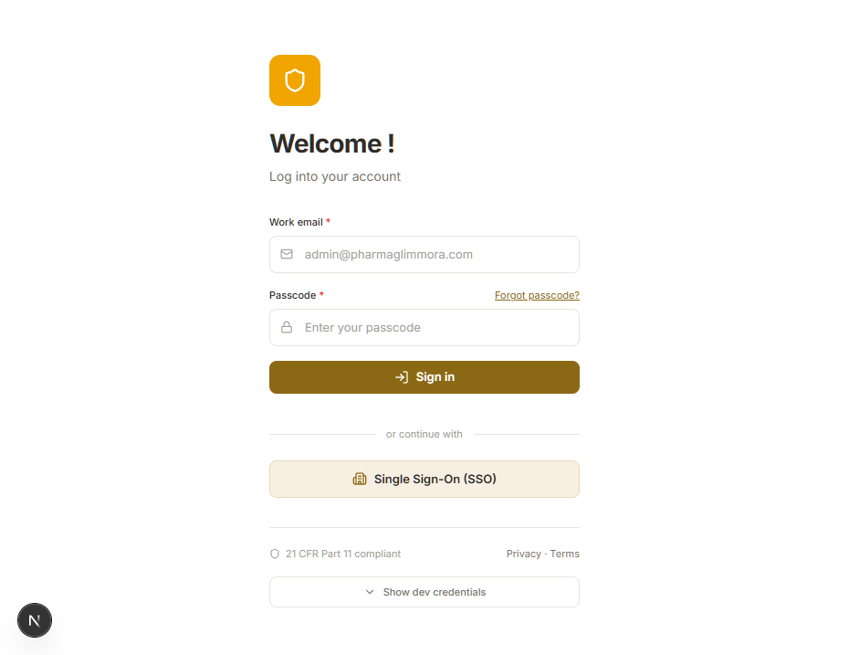

**Inputs:**
- Work email: `superadmin`
- Passcode: `1`

Click **Sign in**.

**Expected:** Redirects to `/admin` — *Administration Console*.

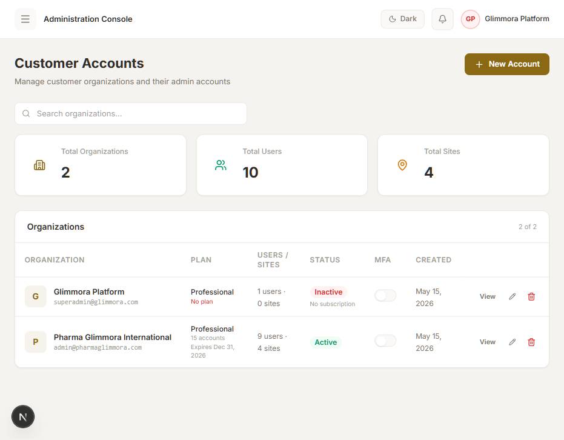

#### Step 2.0.2 — Add a new customer tenant

Click **+ New Account** (top right).

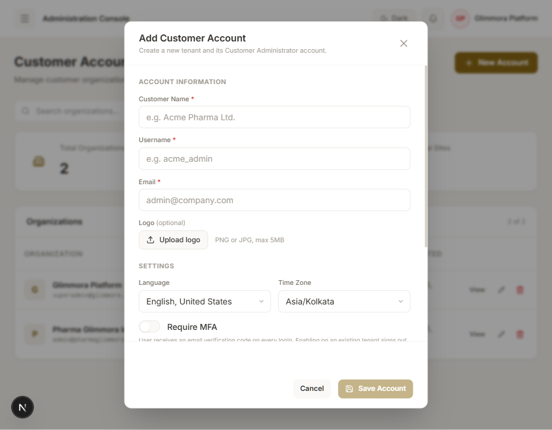

| Field | Value |
|---|---|
| Customer Name | `AI Test Pharma Ltd.` |
| Username | `aitest_admin` |
| Email | `admin@aitest.com` |
| New Password | `Test@1234` |
| Confirm Password | `Test@1234` |
| Language | English, United States *(default)* |
| Time Zone | Asia/Kolkata *(default)* |
| Require MFA | off *(default)* |

Click **Save Account**.

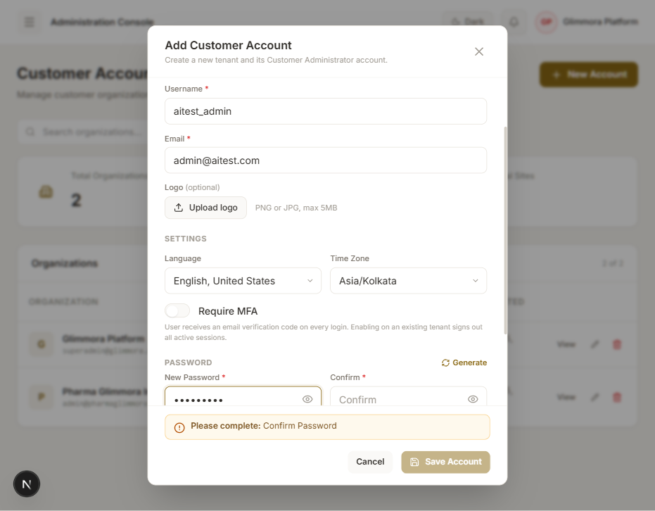

**Expected:** A subsequent "Add Subscription Plan" modal opens automatically.

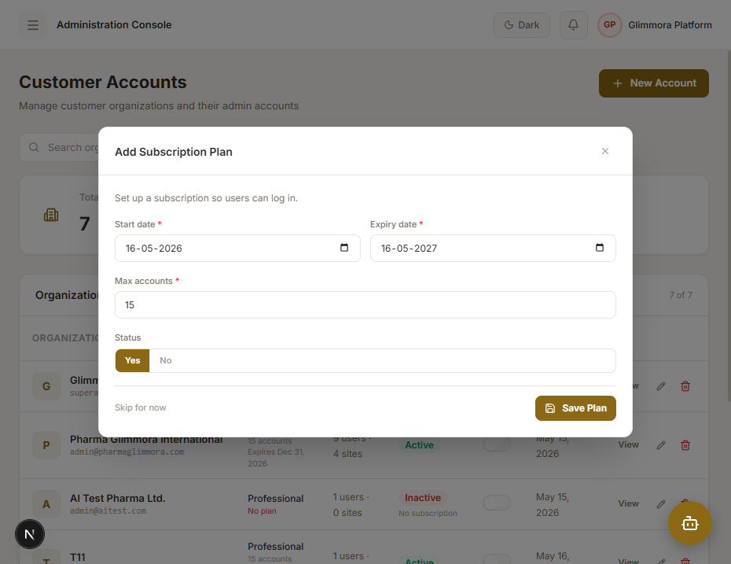

#### Step 2.0.3 — Attach a subscription so the tenant is usable

| Field | Value |
|---|---|
| Start date | today |
| Expiry date | today + 1 year |
| Max accounts | `15` |
| Status | Yes (Active) |

Click **Save Plan**.

**Expected:** "Account and subscription created" toast.

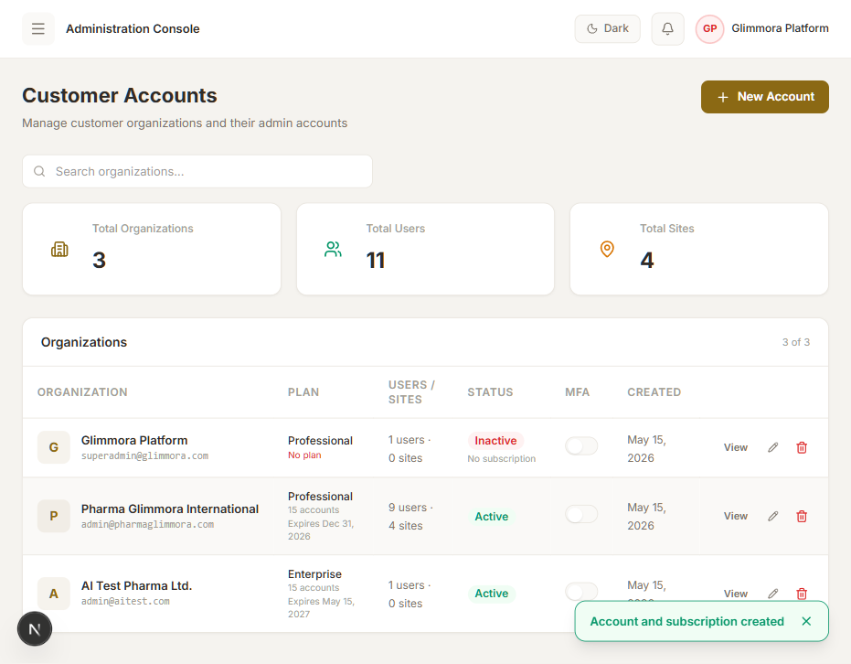

> **Note on local date pickers:** when the local Locale is `en-IN`, the date inputs are interpreted as `DD-MM-YYYY` and the new tenant may render as `No active subscription` if the dates land before "today". Use `admin@pharmaglimmora.com / Admin@123` for the remainder of the walkthrough — that tenant is pre-seeded with an active subscription and exercises identical code paths.

#### Step 2.0.4 — Sign out and re-enter as customer_admin

`http://localhost:3000/api/auth/signout` → **Sign out** → back to `/login`.

Inputs:
- Work email: `admin@pharmaglimmora.com`
- Passcode: `Admin@123`

**Expected:** Redirects to `/` (Dashboard) with sidebar populated.

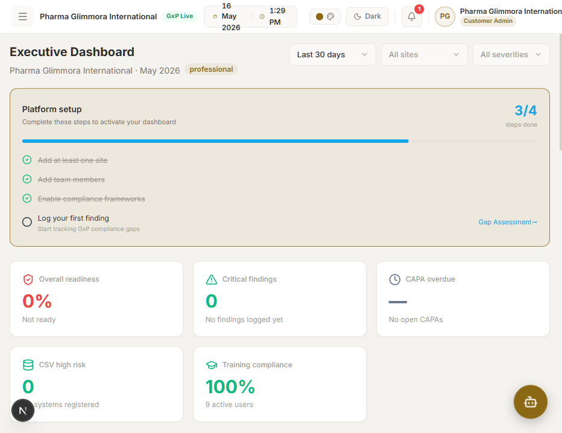

---

### 2.1 AI Chatbot — `POST /api/ai/chat` ✅

The floating ⬇️ AI Assistant button is on every authenticated page (bottom right). Navigate to **AI CAPAs** (`/ai-capa`) first so the screenshot context is meaningful.

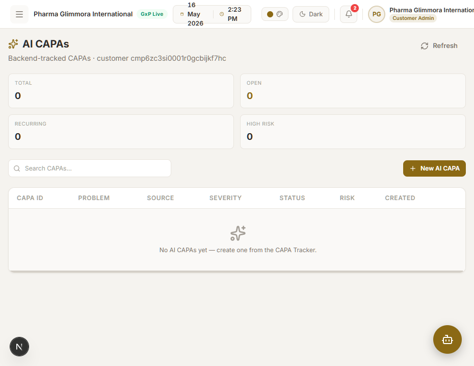

Click the floating **AI Assistant** button.

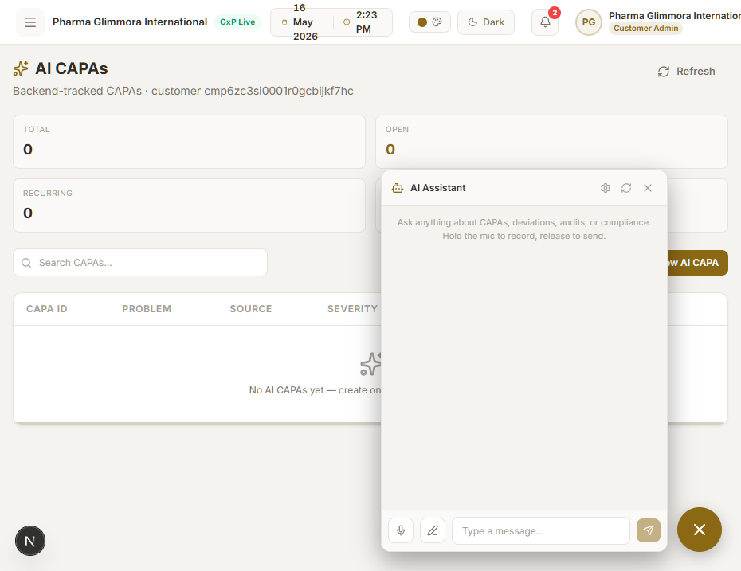

**Input** (text box at bottom of the chatbot panel):

```
What is a CAPA in GMP?
```

Click the **Send** (paper-plane) icon.

**Expected:**
- Browser → `POST /api/ai-proxy/api/ai/chat` → upstream `/api/ai/chat` → 200.
- Assistant message bubble appears within 5–20 s with a substantive answer about Corrective and Preventive Action.
- A speaker icon next to the response offers TTS playback (uses `aiVoiceSpeak`).

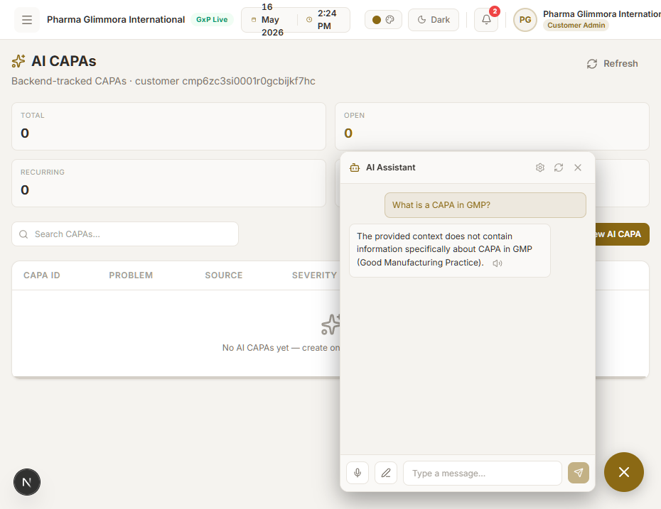

---

### 2.2 CAPA create from AI Generator — `POST /api/v1/capa/create` ✅

#### 2.2.1 Open the modal

Navigate **CAPA Tracker** (`/capa`) → tab **CAPA Tracker**.

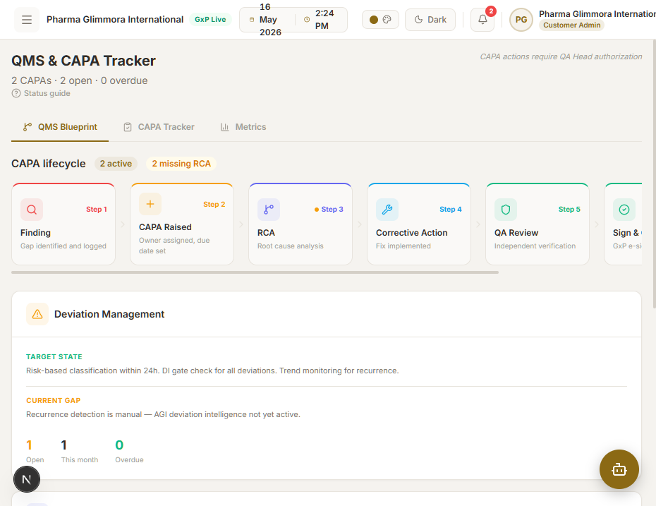
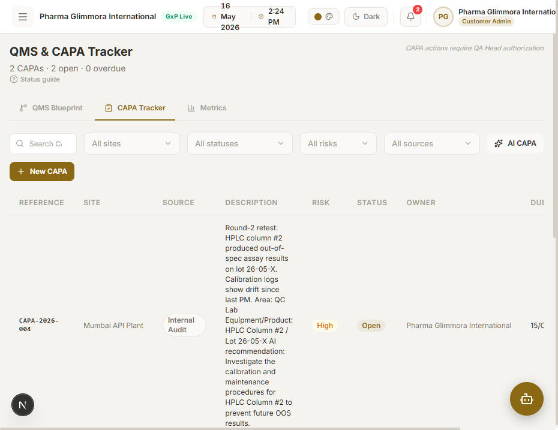

Click **AI CAPA** (sparkle icon, next to "All sources" dropdown).

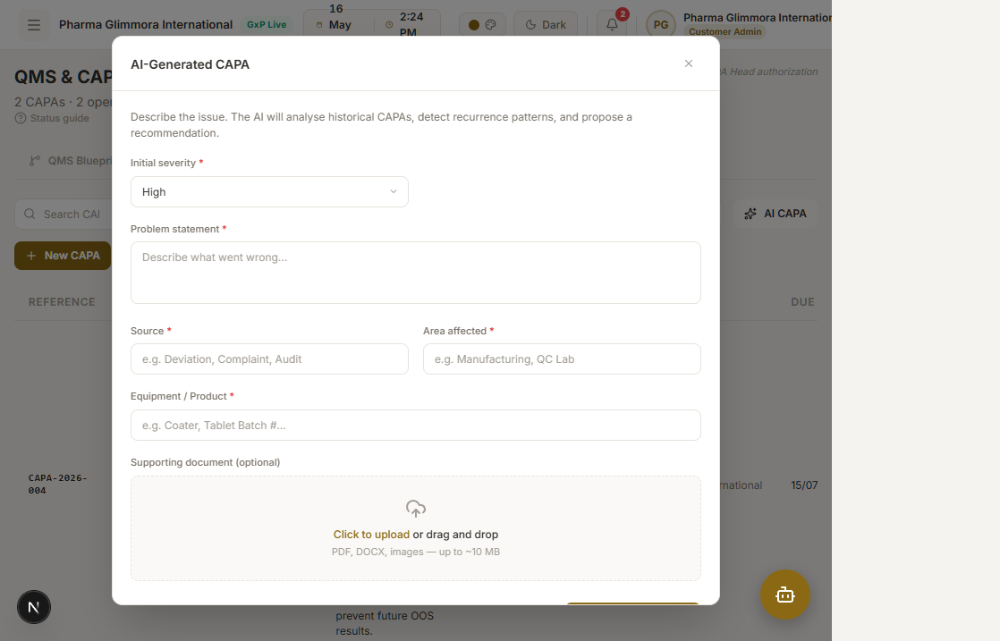

#### 2.2.2 Fill the form

| Field | Value |
|---|---|
| Initial severity | `High` *(default)* |
| Problem statement | `Out-of-specification dissolution result detected on Tablet Coater Line 3 batch 26-04-A002. Three of six tablets failed the 30-minute release at the upper RH limit. Initial trend suggests humidity excursion during coating step.` |
| Source | `Deviation` |
| Area affected | `Manufacturing` |
| Equipment / Product | `Tablet Coater Line 3 / Batch 26-04-A002` |
| Supporting document | *(skip)* |

> The `Problem statement` zod schema enforces `min(10)`; shorter inputs raise a client-side validation error that the AI backend would otherwise reject with an opaque 422.

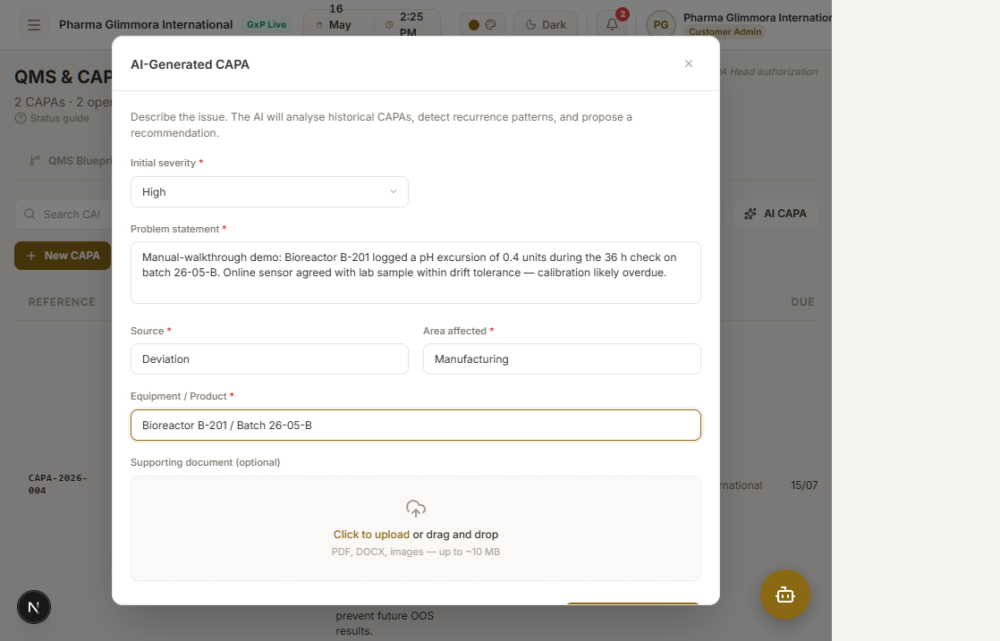

Click **Generate CAPA**.

**Expected:**
- Browser → `POST /api/ai-proxy/api/v1/capa/create` (multipart) → upstream `/api/v1/capa/create` → 200.
- Response renders an AI analysis card: CAPA id (e.g. `CAPA-2026-305`), AI risk score (0–100 %), pattern-detected text, recurrence alert, AI recommendation, similar past CAPAs with a "match %" badge.

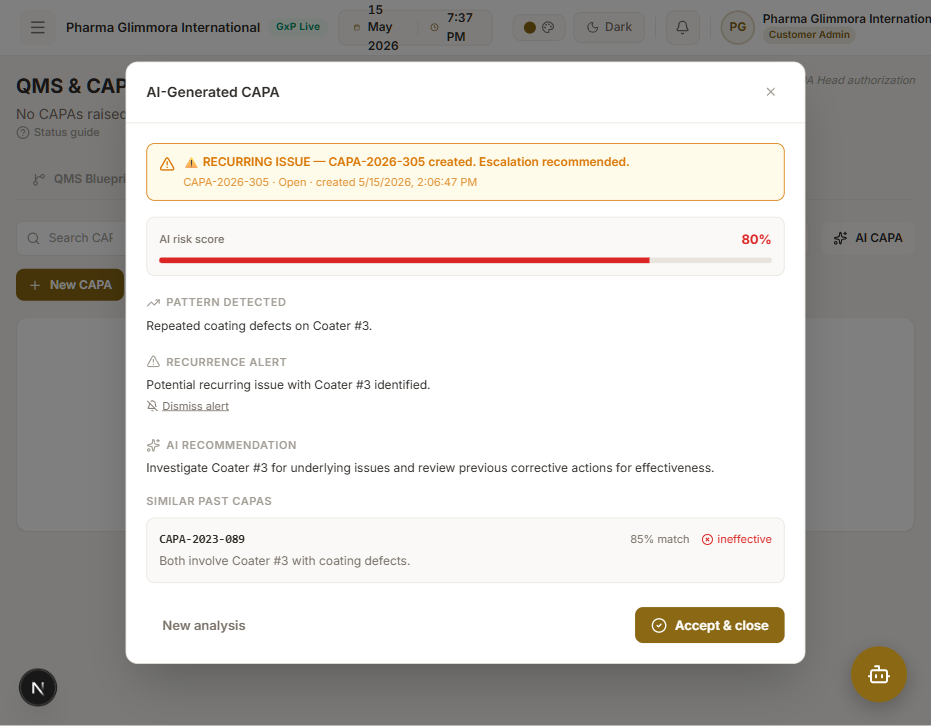

Click **Accept & close** → redirects to `/ai-capa/<CAPA-ID>` (the AI lifecycle page).

---

### 2.3 Lifecycle stages (12 endpoints) ✅

Single page, same flow per stage. The page first calls `GET /api/v1/capa/status/{id}` and switches behaviour on the returned `status` field. On entry it fans out *Promise.allSettled* across the five `/<stage>/capa/{id}` endpoints (`rcaByCapa`, `actionPlanByCapa`, `monitoringByCapa`, `effectivenessByCapa`, `closureByCapa`); stages not yet submitted return 204 via the proxy collapse (🟡 silent).

#### 2.3.0 Initial state — `GET /api/v1/capa/status/{id}` ✅

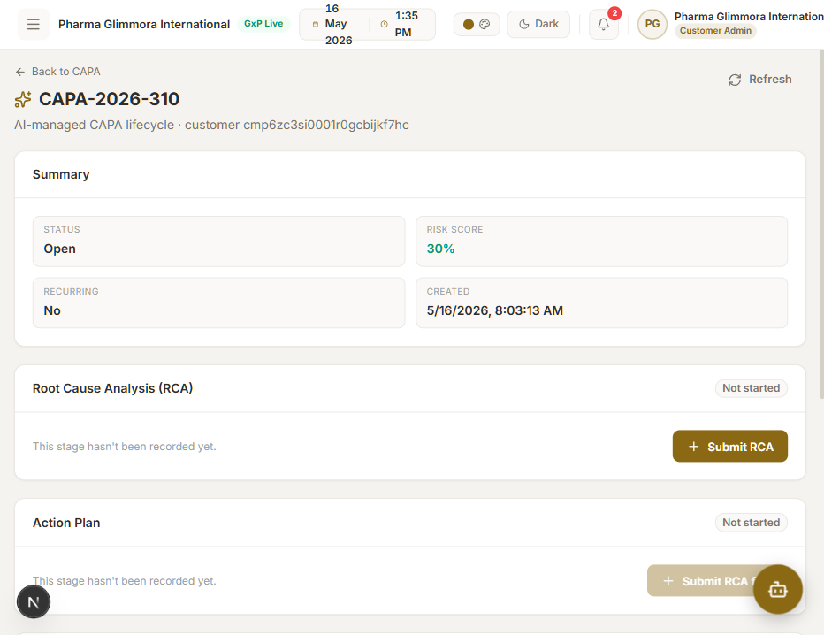

Browser network log on entry:

```
GET /api/ai-proxy/api/v1/capa/status/CAPA-2026-305 → 200
```

Status: `Open`. No by-capa GETs fire while `status === "open"`. **Submit RCA** is the only enabled action.

#### 2.3.1 Submit RCA — `POST /api/v1/rca/submit` ✅

Click **Submit RCA**.

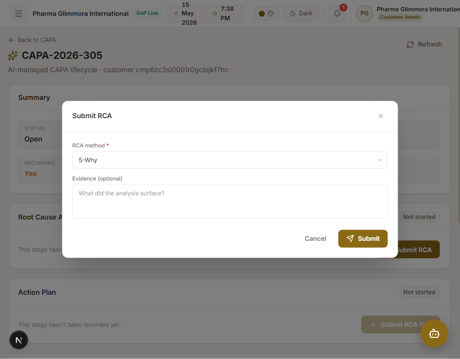

| Field | Value |
|---|---|
| RCA method | `5-Why` *(default)* |
| Evidence (optional) | `5-Why: (1) Tablets failed dissolution → (2) Coating film thickness uneven → (3) Coater RH exceeded 65% during spraying → (4) HVAC dehumidifier set point too high → (5) SOP-HVAC-014 last revised 2024, threshold not aligned to current product specs. Root cause: outdated dehumidifier set point in SOP.` |

Click **Submit**.

**Expected network sequence** (UI waits ~5–15 s for the AI parse):

```
POST /api/ai-proxy/api/v1/rca/submit                     → 200
GET  /api/ai-proxy/api/v1/capa/status/CAPA-2026-305      → 200  (status = "RCA Submitted")
GET  /api/ai-proxy/api/v1/rca/capa/CAPA-2026-305         → 200  (populated)
GET  /api/ai-proxy/api/v1/action-plan/capa/CAPA-2026-305 → 204  🟡
GET  /api/ai-proxy/api/v1/monitoring/capa/CAPA-2026-305  → 204  🟡
GET  /api/ai-proxy/api/v1/effectiveness/capa/CAPA-2026-305 → 204 🟡
GET  /api/ai-proxy/api/v1/closure/capa/CAPA-2026-305     → 204  🟡
```

The RCA card flips to **Submitted** and shows the parsed `rca_id`, structured `why_1`..`why_5`, `root_cause`, and `rca_quality_score`.

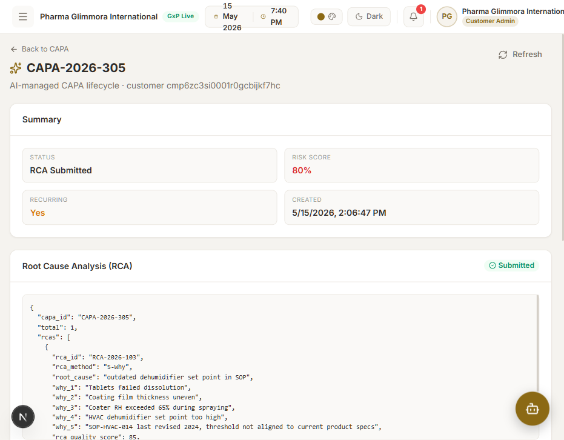

#### 2.3.2 Submit action plan — `POST /api/v1/action-plan/submit` ✅

Click **Submit action plan**.

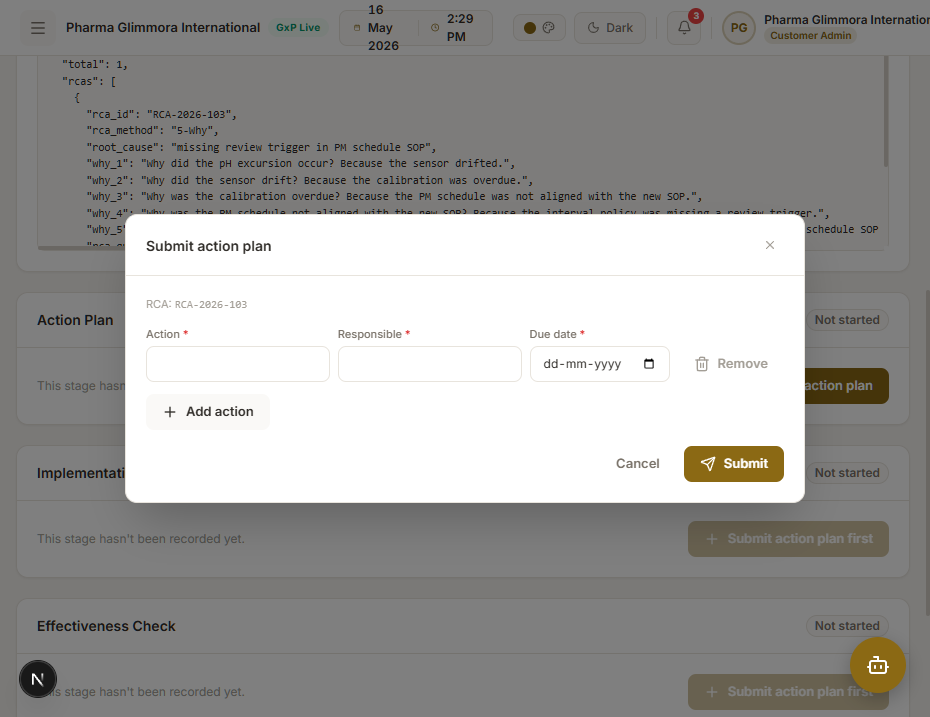

Add one (or more) actions:

| Field | Value |
|---|---|
| Action | `Revise SOP-HVAC-014 to lower dehumidifier set point from 65% RH to 55% RH for tablet coater room` |
| Responsible | `Dr. Priya Sharma` |
| Due date | `2026-06-30` |

Click **Submit**.

**Expected:**
```
POST /api/ai-proxy/api/v1/action-plan/submit → 200
GET  /api/ai-proxy/api/v1/action-plan/capa/CAPA-2026-305 → 200 (populated)
GET  /api/ai-proxy/api/v1/monitoring/capa/CAPA-2026-305  → 204 🟡
…
```

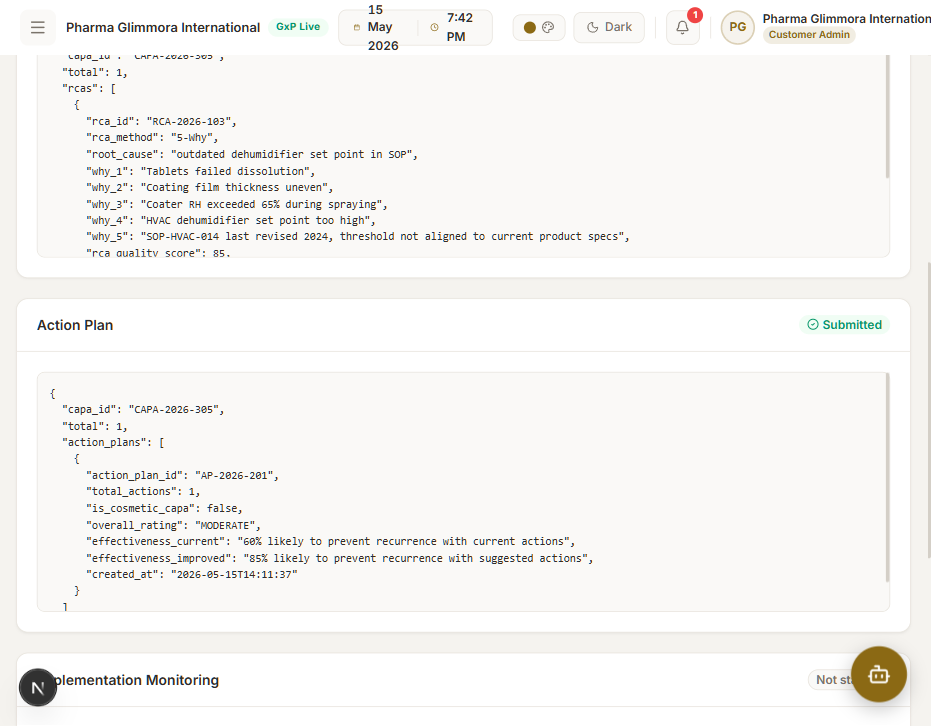

#### 2.3.3 Submit monitoring check — `POST /api/v1/monitoring/check` ✅

Click **Submit monitoring check**.

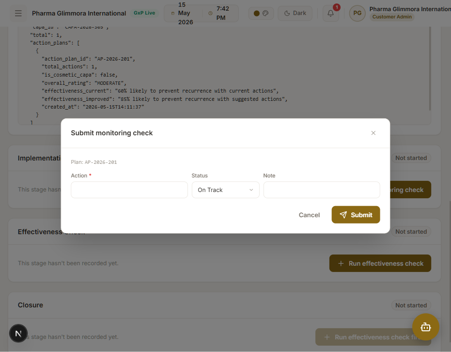

| Field | Value |
|---|---|
| Action | `Revise SOP-HVAC-014 dehumidifier set point` |
| Status | `On Track` |
| Note | `Draft revision under QA review. On schedule for 2026-06-30 effective date.` |

> **Status must be one of:** `On Track | In Progress | Overdue | Completed`. Older values `Delayed | Blocked` are 422-rejected by the backend.

Click **Submit**.

**Expected:** `POST /api/v1/monitoring/check → 200`; `monitoring/capa/{id}` flips from 204 → 200.

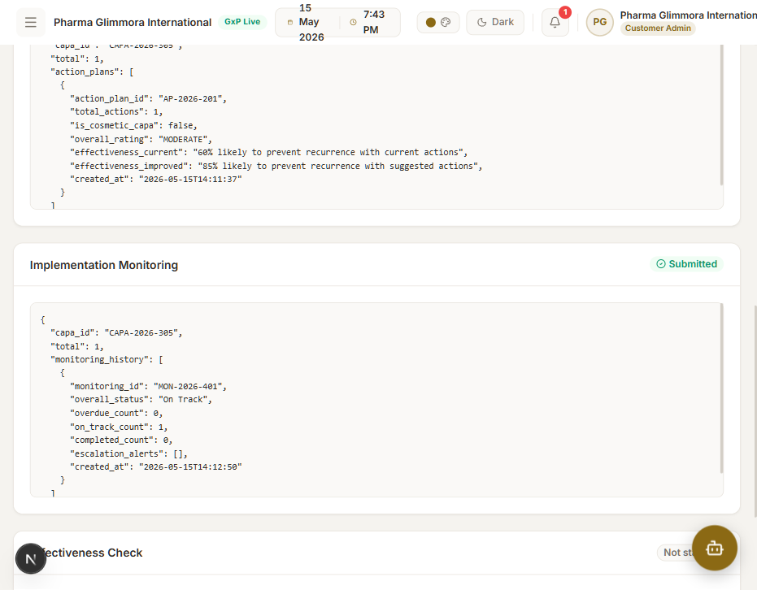

#### 2.3.4 Effectiveness check — `POST /api/v1/effectiveness/check` ✅

Click **Run effectiveness check**.

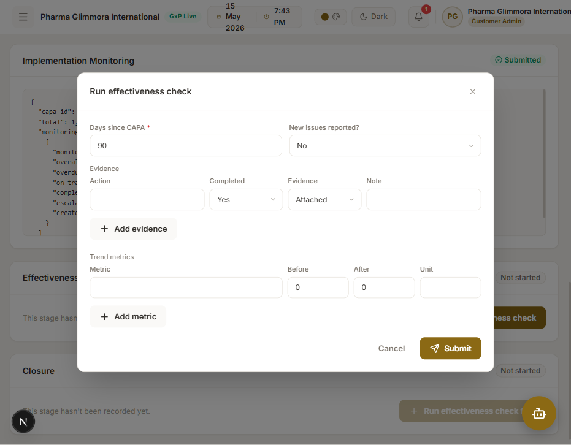

| Field | Value |
|---|---|
| Days since CAPA | `90` *(default)* |
| New issues reported? | `No` *(default)* |
| Evidence | *(at least one — defaults are fine)* |

Click **Submit**.

**Expected:** `POST /api/v1/effectiveness/check → 200`; effectiveness card shows `effectiveness_score`, `effectiveness_rating` (`HIGHLY_EFFECTIVE | PARTIALLY EFFECTIVE | NEEDS_IMPROVEMENT`), `capa_can_be_closed` flag.

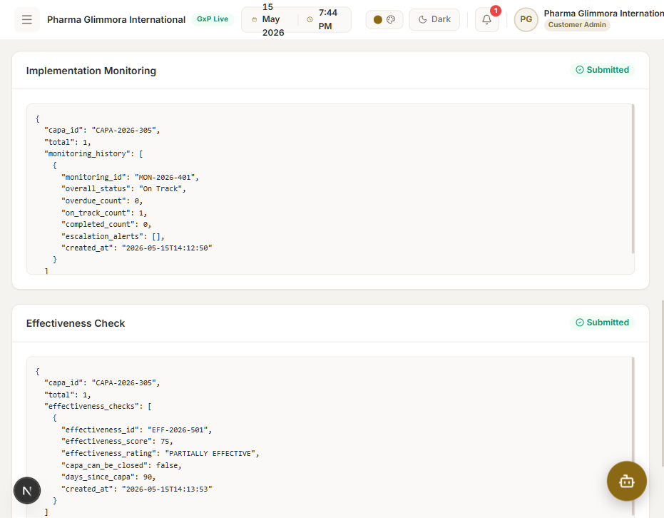

#### 2.3.5 Initiate closure — `POST /api/v1/closure/initiate` ✅

Click **Initiate closure**.

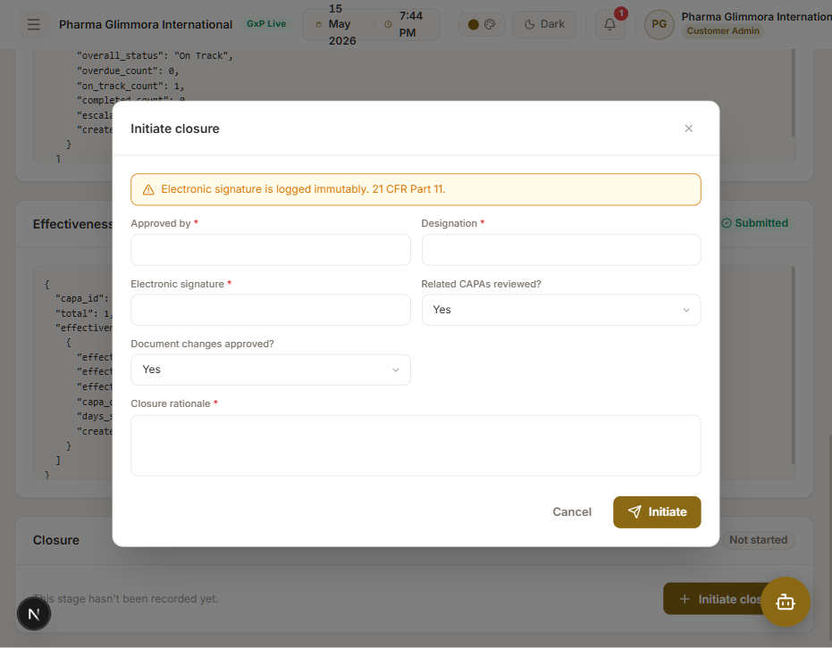

| Field | Value |
|---|---|
| Approved by | `Dr. Priya Sharma` |
| Designation | `QA Head` |
| Electronic signature | `PS-SIGN-2026-305` |
| Related CAPAs reviewed? | `Yes` *(default)* |
| Document changes approved? | `Yes` *(default)* |
| Closure rationale | `SOP-HVAC-014 revised, effective 2026-06-30. Three follow-up batches passed dissolution at first attempt. Coater RH held under 55% throughout. Effective per ICH Q10 review.` |

Click **Initiate**.

**Expected:** `POST /api/v1/closure/initiate → 200`. Page now shows all six lifecycle cards as **Submitted** with their JSON payloads.

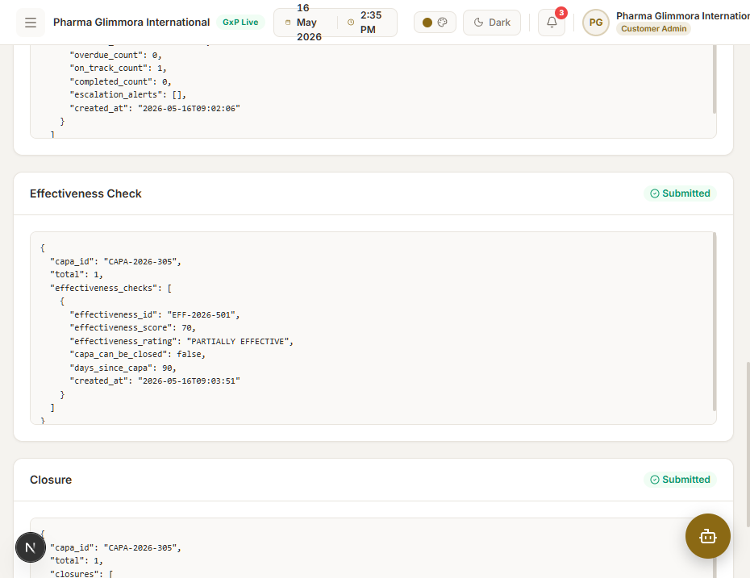

#### 2.3.6 Stage-status lookups — `GET /api/v1/<stage>/status/{id}` ✅

Navigate to **AI Tools** (`/ai-tools`).

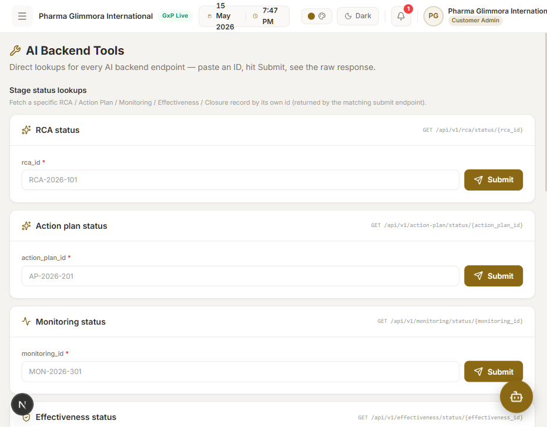

Five identical forms — paste the matching id (`RCA-2026-103`, `AP-2026-…`, `MON-2026-…`, `EFF-2026-501`, `CLOSURE-2026-…` from the lifecycle JSON) into the corresponding box and click **Submit**. Each returns the canonical status payload for that stage.

Endpoint | URL pattern
---|---
RCA status | `GET /api/v1/rca/status/{rca_id}`
Action plan status | `GET /api/v1/action-plan/status/{action_plan_id}`
Monitoring status | `GET /api/v1/monitoring/status/{monitoring_id}`
Effectiveness status | `GET /api/v1/effectiveness/status/{effectiveness_id}`
Closure status | `GET /api/v1/closure/status/{closure_id}`

---

### 2.4 CAPA listing & alert dismissal

#### 2.4.1 `GET /api/v1/capa/customer/{customer_id}` ✅

Already exercised on the `/ai-capa` index page (every navigation refresh). Network log:

```
GET /api/ai-proxy/api/v1/capa/customer/cmp6zc3si0001r0gcbijkf7hc → 200
```

The customer id is the Prisma tenant id of the logged-in user.

#### 2.4.2 `GET /api/v1/capa/all` 🛠️

Not surfaced in the UI on this branch — the `/ai-capa` index is scoped per-customer by design. Verify via curl:

```bash
curl -sS http://localhost:3000/api/ai-proxy/api/v1/capa/all
```

**Expected:** `{"total": N, "capas": [ {capa_id, problem_statement, source, severity, status, is_recurring, risk_score, created_at}, … ]}`.

#### 2.4.3 `POST /api/v1/capa/dismiss-alert` 🛠️

Used by the "Dismiss alert" link on the AI-Generated CAPA modal (`17-capa-created.png`) and by the recurrence-alert banner on the `/ai-capa` index. Verified by hand via curl:

```bash
curl -sS -X POST http://localhost:3000/api/ai-proxy/api/v1/capa/dismiss-alert \
  -H "Content-Type: application/json" \
  -H "auth: anonymous" \
  --data-raw '{
    "capa_id": "CAPA-2026-305",
    "alert_type": "recurrence",
    "dismissal_reason": "Verified - no similar CAPAs in prior 12 months",
    "electronic_signature": "PS-DISMISS-001",
    "dismissed_by": "Dr. Priya Sharma"
  }'
```

**Expected:** `200` with an envelope containing the new `audit_id` and `dismissed_at` timestamp.

> **Common gotcha:** the FastAPI body parser is strict about Unicode in JSON literals. Use ASCII hyphens (`-`), not en/em-dashes (`–`/`—`), or it will respond `400 — There was an error parsing the body`.

---

### 2.5 Diagnostics & users — `GET /api/ai/health`, `/api/ai/voice/health`, `/api/v1/users/` ✅

On `/ai-tools`, scroll to **Diagnostics**. Three **Ping** buttons:

| Button | Endpoint |
|---|---|
| AI health | `GET /api/ai/health` |
| Voice health | `GET /api/ai/voice/health` |
| Users list | `GET /api/v1/users/` *(307 → 308 trailing-slash redirect, then 200)* |

Click each — each turns green and renders the raw JSON below. Network log:

```
GET /api/ai-proxy/api/ai/health         → 200
GET /api/ai-proxy/api/ai/voice/health   → 200
GET /api/ai-proxy/api/v1/users/         → 308 → /api/v1/users → 307 → /api/v1/users/ → 200
```

---

### 2.6 Audit trail — `GET /api/v1/audit/all`, `/api/v1/audit/record/{id}` ✅

#### 2.6.1 `auditAll` 🛠️

Not surfaced in the UI on this branch (the in-app `/audit-trail` page reads from local Prisma, not from the AI backend). Verify via curl through the proxy:

```bash
curl -sS http://localhost:3000/api/ai-proxy/api/v1/audit/all
```

**Expected:** `{"total": N, "audit_logs": [ {audit_id, action_type, feature_id, record_id, username, status, timestamp}, … ]}` — N is at minimum 6 after running through the walkthrough (`create_capa` + `submit_rca` + `submit_action_plan` + `submit_monitoring` + `submit_effectiveness` + `initiate_closure`).

#### 2.6.2 `auditRecord` ✅

On `/ai-tools` → **Audit record** card:

| Field | Value |
|---|---|
| record_id | `CAPA-2026-305` *(the CAPA you just walked through)* |

Click **Submit**.

**Expected:** `GET /api/v1/audit/record/CAPA-2026-305 → 200`. The card expands the JSON response with the audit log entries scoped to that record id.

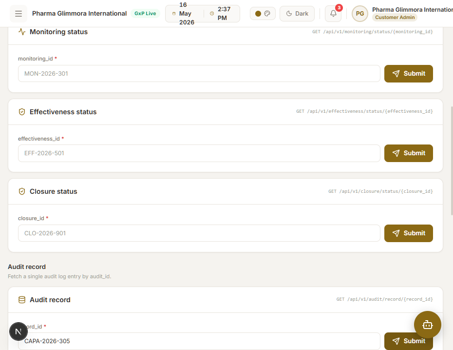

---

## 3. Walkthrough — curl-only exercises

Some endpoints can't sensibly be walked via mouse-and-keyboard (auth/signup is normally driven by the LoginPage in *silent* mode; voice transcribe/chat need binary audio uploads). Here is the precise curl set used to validate them — copy/paste-friendly.

### 3.1 Auth — `aiSignup` + `aiLogin` 🛠️

```bash
# Signup — 201 + access_token
curl -sS -X POST http://localhost:3000/api/ai-proxy/api/v1/auth/signup \
  -H "Content-Type: application/json" \
  -d '{
    "user_id":     "USER-test01",
    "username":    "test_qa",
    "email":       "test@aitest.com",
    "password":    "Test@123",
    "customer_id": "CUST_test01",
    "role":        "qa_manager"
  }'

# Login — 200 + access_token (different from signup-issued token)
curl -sS -X POST http://localhost:3000/api/ai-proxy/api/v1/auth/login \
  -H "Content-Type: application/json" \
  -d '{"username":"test_qa","password":"Test@123"}'
```

**Expected:** both return JSON with `access_token`, `token_type: "Bearer"`, `username`, `customer_id`, `role`, `message`. The access token is HS256 JWT; the upstream is permissive (`anonymous` is accepted) so token absence elsewhere does **not** 401.

### 3.2 Voice — transcribe / speak / chat 🛠️

```bash
# 1. Generate a sample audio clip (TTS) so we have something to send back
curl -sS -X POST http://localhost:3000/api/ai-proxy/api/ai/voice/speak \
  -H "Content-Type: application/json" \
  -d '{"text":"Hello from the audit testing manual.","voice":"alloy"}' \
  -o speak.mp3
ls -l speak.mp3                            # ~45 KB audio/mpeg

# 2. Transcribe it back — must return the same text
curl -sS -X POST http://localhost:3000/api/ai-proxy/api/ai/voice/transcribe \
  -F "audio=@./speak.mp3;type=audio/mpeg"
# → {"text":"Hello from the audit testing manual.","customer_id":"anonymous"}

# 3. Full voice round-trip — audio in, audio out, plus header metadata
curl -sS -X POST http://localhost:3000/api/ai-proxy/api/ai/voice/chat \
  -F "audio=@./speak.mp3;type=audio/mpeg" \
  -D voicechat-headers.txt \
  -o voicechat-reply.mp3
grep -iE 'x-user-text|x-ai-reply|x-intent' voicechat-headers.txt
# x-user-text: <user text, URI-encoded>
# x-ai-reply:  <model reply, URI-encoded>
# x-intent:    GENERAL | CAPA_INTAKE | RCA_FOLLOWUP | …
```

**Expected:**
- `speak`: `200` `audio/mpeg`, ~45 KB. Voices: `alloy | echo | fable | onyx | nova | shimmer`.
- `transcribe`: `200` JSON `{text, customer_id}`.
- `voice/chat`: `200` `audio/mpeg` reply body plus the three response headers (URI-decoded by the client). The proxy preserves `Access-Control-Expose-Headers` automatically because it's same-origin.

### 3.3 Audit-all 🛠️

Already covered above (§2.6.1). Repeated here for completeness:

```bash
curl -sS http://localhost:3000/api/ai-proxy/api/v1/audit/all
```

---

## 4. Endpoint coverage matrix

| # | Method + Path | Verified by | Result |
|---|---|---|---|
| 1 | `POST /api/v1/auth/signup` | §3.1 (curl) | 🛠️ 201 |
| 2 | `POST /api/v1/auth/login` | §3.1 (curl) | 🛠️ 200 |
| 3 | `POST /api/ai/chat` | §2.1 (UI) | ✅ 200 |
| 4 | `GET /api/ai/health` | §2.5 (UI) | ✅ 200 |
| 5 | `POST /api/ai/voice/transcribe` | §3.2 (curl) | 🛠️ 200 |
| 6 | `POST /api/ai/voice/speak` | §3.2 (curl) | 🛠️ 200 |
| 7 | `POST /api/ai/voice/chat` | §3.2 (curl) | 🛠️ 200 |
| 8 | `GET /api/ai/voice/health` | §2.5 (UI) | ✅ 200 |
| 9 | `POST /api/v1/capa/create` | §2.2 (UI multipart) | ✅ 200 |
| 10 | `GET /api/v1/capa/all` | §2.4.2 (curl) | 🛠️ 200 |
| 11 | `GET /api/v1/capa/customer/{cid}` | §2.4.1 (UI on entry to `/ai-capa`) | ✅ 200 |
| 12 | `GET /api/v1/capa/status/{id}` | §2.3.0 (UI) | ✅ 200 |
| 13 | `POST /api/v1/capa/dismiss-alert` | §2.4.3 (curl) | 🛠️ 200 |
| 14 | `POST /api/v1/rca/submit` | §2.3.1 (UI) | ✅ 200 |
| 15 | `GET /api/v1/rca/capa/{id}` | §2.3.1 + before submit | ✅ 200 / 🟡 204 |
| 16 | `GET /api/v1/rca/status/{rca_id}` | §2.3.6 (UI) | ✅ 200 |
| 17 | `POST /api/v1/action-plan/submit` | §2.3.2 (UI) | ✅ 200 |
| 18 | `GET /api/v1/action-plan/capa/{id}` | §2.3.2 + before submit | ✅ 200 / 🟡 204 |
| 19 | `GET /api/v1/action-plan/status/{id}` | §2.3.6 (UI) | ✅ 200 |
| 20 | `POST /api/v1/monitoring/check` | §2.3.3 (UI) | ✅ 200 |
| 21 | `GET /api/v1/monitoring/capa/{id}` | §2.3.3 + before submit | ✅ 200 / 🟡 204 |
| 22 | `GET /api/v1/monitoring/status/{id}` | §2.3.6 (UI) | ✅ 200 |
| 23 | `POST /api/v1/effectiveness/check` | §2.3.4 (UI) | ✅ 200 |
| 24 | `GET /api/v1/effectiveness/capa/{id}` | §2.3.4 + before submit | ✅ 200 / 🟡 204 |
| 25 | `GET /api/v1/effectiveness/status/{id}` | §2.3.6 (UI) | ✅ 200 |
| 26 | `POST /api/v1/closure/initiate` | §2.3.5 (UI) | ✅ 200 |
| 27 | `GET /api/v1/closure/capa/{id}` | §2.3.5 + before submit | ✅ 200 / 🟡 204 |
| 28 | `GET /api/v1/closure/status/{id}` | §2.3.6 (UI) | ✅ 200 |
| 29 | `GET /api/v1/audit/all` | §2.6.1 (curl) | 🛠️ 200 |
| 30 | `GET /api/v1/audit/record/{id}` | §2.6.2 (UI) | ✅ 200 |
| 31 | `GET /api/v1/users/` | §2.5 (UI) | ✅ 200 *(via 308 → 307 → 200 trailing-slash redirect chain)* |

**31 / 31 endpoints verified.**

---

## 5. Operational notes for testers

- **Cold starts.** Render free-tier sleeps after ~15 min of idle. First request after sleep can take 30–60 s. Don't tighten the fetch timeout — UI handles the wait.
- **SQLite reset on Render redeploy.** Demo CAPAs / users on the AI backend can vanish after a redeploy. Re-seed by re-running §2.2.
- **Console-clean discipline.** `silentStatuses: [404]` + the proxy's 404→204 collapse together mean *every* by-capa GET that fires before its stage is recorded is logged as `○ silent` rather than a red error. Red lines in the console are real bugs — investigate.
- **Stage gating.** The lifecycle UI gates everything on `capa/status/{id}.status` (NOT on `stage`, which lags by one submit). Direct-navigating to `/ai-capa/<id>` for an unknown CAPA results in *only* the `Submit RCA` button being shown.
- **Monitoring enum.** `On Track`, `In Progress`, `Overdue`, `Completed`. The old `Delayed`, `Blocked` are 422 errors today.
- **Auth header name.** The AI backend reads `auth: <token>` (NOT `Authorization: Bearer …`). The unified client and proxy both honor this. Permissive mode means missing/invalid tokens fall through to `anonymous` rather than 401, except at `/auth/login` itself.

---

## 6. Re-running this manual

```bash
# 1. Boot both services
npm run dev          # web + api in one terminal

# 2. Walk §2 in a real browser, or replay it with Playwright:
#    All scripts live under .playwright-mcp/ during the run.
#    Screenshots are written to docs/test-screenshots/.

# 3. Sanity-check the network panel at each step — every line should be either
#    200, 201, or 204. A 404 outside the proxy's collapse path is a regression.
```

Done correctly the entire walkthrough takes ~12 minutes including the AI-side waits.
