# CAPA Lifecycle — Gap Report

Discovery-only analysis of Glimmora-Pharma against the spec
*"CAPA Lifecycle: Stages & Substages | GxP Reference"* (9 stages, 61 substages,
4 AI agents). No application code modified. Findings cite file:line throughout.

> **Headline:** the platform implements ~5 of 61 substages cleanly. Most CAPA
> regulatory anchors (Stage 2 risk scoring, Stage 4 EC criteria locking,
> Stage 5 tiered approval, Stage 6 implementation tracking, Stage 7
> effectiveness verification, Stage 9 trending) are unimplemented. The
> "AGI Console" is a UI shell with **zero LLM integration** — none of
> AI-100, AI-102, AI-104, AI-203 exist by name or function. Part 11
> e-signature is captured in the UI but **not persisted as an immutable
> signed-record artifact** on closure.

---

## 1. Repo Snapshot

| Aspect | Value |
|---|---|
| **Project type** | Multi-tenant GxP/GMP inspection-readiness SaaS (CAPA-centric) |
| **Languages** | TypeScript 5.9, SQL (Prisma) |
| **Framework** | Next.js 16.2 App Router (primary) + Pages Router (NextAuth + `/api/auth/me`) |
| **UI** | React 19.2, Tailwind v4.2, Redux Toolkit 2.11 (hybrid w/ Server Actions), lucide-react, recharts |
| **Forms** | react-hook-form 7.71 + zod 4.3 |
| **Auth** | NextAuth 4.24 (Credentials, JWT), bcryptjs 3, MFA via OTP through Gmail SMTP (nodemailer 8) |
| **Database / ORM** | SQLite via Prisma 6.19 (dev/local; prod target unspecified) |
| **Package manager** | npm |
| **Build / Test** | `next build`, `playwright test` (single smoke spec) |
| **Files of note** | 23 Prisma models, 14 server-action files, ~160 client components |

### Top-level folders

| Folder | Purpose |
|---|---|
| `app/` | Next.js App Router. Layout groups `(admin)` and `(app)`. One App-Router API route at [app/api/evidence/files/[id]/route.ts](../app/api/evidence/files/[id]/route.ts). |
| `pages/api/` | Pages Router. NextAuth catch-all + `/api/auth/me` only. |
| `prisma/` | `schema.prisma` (single source of truth), 6 migrations through 2026-05-02, idempotent `seed.ts`, dev SQLite committed. |
| `proxy.ts` | Next middleware (named `proxy`, not `middleware`) — auth + role gate. |
| `src/components/` | `ui/` primitives, `layout/` shell, `shared/` widgets, `auth/`, `errors/` |
| `src/modules/` | One folder per domain: `admin`, `capa`, `csv-csa`, `deviation`, `evidence`, `fda-483`, `gap-assessment`, `governance`, `inspection`, `readiness`, `agi-console`, `settings`, `audit-trail`, `dashboard` |
| `src/store/` | 11 Redux slices + `persistence.ts` (debounced localStorage) |
| `src/hooks/` | `useRole`, `useTenantConfig`, `useTenantData`, `useNotificationEngine` + 9 others |
| `src/lib/` | `prisma`, `auth`, `mailer`, `audit`, `dayjs`, `fileStorage`, `tenantStatus`, plus `queries/` and `mappers/` |
| `src/actions/` | 14 server-action files (`"use server"`); every mutation routes through here |
| `src/schemas/` | Zod schemas paired with form resolvers |
| `tests/` | Single Playwright smoke spec ([tests/smoke.spec.ts](../tests/smoke.spec.ts)) — auth surface only |

### Entry points

- **App entry** — [app/layout.tsx](../app/layout.tsx) → `<Providers>` (Redux + theme)
- **Authenticated user shell** — [app/(app)/layout.tsx](../app/(app)/layout.tsx) → async server component → `<AppShell>`
- **Admin shell** — [app/(admin)/layout.tsx](../app/(admin)/layout.tsx) → `"use client"` → `<AdminShell>`
- **Auth catch-all** — [pages/api/auth/[...nextauth].ts](../pages/api/auth/[...nextauth].ts)
- **Middleware** — [proxy.ts](../proxy.ts) — JWT gate + `/admin/*` role gate
- **Workers / cron** — **NONE.** No scheduled jobs, no background workers, no queue. (Material gap — see Stage 7 / Stage 9 findings.)
- **CLI** — `prisma/seed.ts` and `scripts/{probe-evidence,probe-sanitize,test-mailer}.ts` for one-off ops only.

### Database tables (23 models)

| Model | Purpose |
|---|---|
| `Tenant` | Customer org (multi-tenant root). Fields: `customerCode @unique`, `email @unique`, `passwordHash`, `role` (default `customer_admin`), `mfaEnabled`, `sessionsValidAfter`. |
| `Subscription` | 1:1 with `Tenant`. Fields: `maxAccounts`, `startDate`, `expiryDate`, `status`. |
| `Site` | Facility within a tenant. `@@unique([tenantId, name])`. |
| `User` | Site-scoped user. **`gxpSignatory: Boolean`** is the e-sig gate. `@@unique([tenantId, email])`. |
| `Finding` | Gap-assessment item (Source = Stage 1 trigger). 1:1 with CAPA via `findingId @unique`. |
| `CAPA` | The lifecycle entity — see §2. |
| `CAPADocument` | Legacy doc attachments. Replaced by `EvidenceItem` for the new flow. |
| `Deviation` | Quality event (Source = Stage 1 trigger). Informal `linkedCAPAId` back-link only. |
| `FDA483Event`, `FDA483Observation`, `FDA483Commitment`, `FDA483Document` | Regulatory observation tracking. Has `signatureMeaning` field for e-sig. |
| `GxPSystem`, `ValidationStage`, `RTMEntry`, `RoadmapActivity` | CSV/CSA validation — IQ/OQ/PQ stages, RTM. |
| `Document` | Polymorphic document library (`linkedModule`, `linkedRecordId`). |
| `RAIDItem` | Risk/Assumption/Issue/Decision register. |
| `Inspection`, `ReadinessAction`, `ReadinessCard`, `Simulation`, `Playbook`, `TrainingRecord` | Inspection readiness module. |
| `EvidenceItem`, `EvidenceFile`, `EvidenceNoteVersion` | Wave 3 evidence collection (ALCOA+). `EvidenceFile.contentHashSha256`, `retainUntil` (+7y default), soft-delete only. `EvidenceNoteVersion` is insert-only (immutable). |
| `AuditLog` | Append-only event log: `module`, `action`, `recordId`, `recordTitle`, `oldValue`, `newValue`. **No update/delete operations exist anywhere in code.** |
| `EmailOTP` | MFA OTP store. Composite `(identifier, tenantId)` lookup so it matches either Tenant or User row. |

---

## 2. Domain Model Inventory

### `CAPA` ([prisma/schema.prisma:129-169](../prisma/schema.prisma))

| Field | Type | Notes |
|---|---|---|
| `id` | String @id (cuid) | Internal id |
| `reference` | String? @unique | Human-readable per-tenant-per-year ref ("CAPA-2026-014"). Nullable; backfilled. |
| `tenantId`, `siteId`, `findingId @unique` | FKs | Tenant scope, optional site, 1:1 finding link |
| `source` | String | Free-form; UI enum: `Gap Assessment / Deviation / FDA 483 / Internal Audit / External Audit / Customer Complaint / Other`. Spec §1.1 expects more sources (OOS/OOT, supplier, mgmt review, trend signal, recall) — drift |
| `description` | String | ≥10 chars |
| `risk` | String | UI enum: `Critical / High / Medium / Low` (spec §2.1 uses `catastrophic / critical / major / minor`) — drift |
| `owner` | String | UserConfig.id |
| `dueDate` | DateTime? | Single date; spec §1.4 expects timelines per priority class |
| `status` | String @default("Open") | UI enum: `Open / In Progress / Pending QA Review / Closed`. Spec implies more (Triage, Plan Authorized, In Effectiveness, Closed-Effective vs Closed-Ineffective) — drift |
| `rca`, `rcaMethod` | String? | Free-text RCA + method enum (`5 Why / Fishbone / Fault Tree / Other`). Spec §3.3 lists more (FMEA, Apollo, Why-Because, Kepner-Tregoe). |
| `correctiveActions` | String? | **Free-text newline-delimited** — spec §4.1-4.5 expects structured actions with owner, due date, resources, EC criteria per action |
| `effectivenessCheck` | Boolean @default(false) | Set true at closure |
| `effectivenessDate` | DateTime? | Set to `now+90d` at closure (spec §7 expects per-action EC plan locked at Stage 4) |
| `diGate*` | Boolean + status/notes/reviewedBy/reviewDate | Data-integrity gate. Project-specific; not in spec verbatim but maps loosely to §2.6/§2.7. |
| `closedBy`, `closedAt` | String/DateTime | Closure metadata. **Not a signature record.** |
| `createdBy`, `createdAt`, `updatedAt` | — | Standard metadata |

### `Finding` ([prisma/schema.prisma:104-125](../prisma/schema.prisma))
`severity` (`Critical/High/Low`), `status` (`Open/In Progress/Closed`), `framework`, `targetDate`, `rootCause`, `evidenceLink`, **`linkedCAPAId` informal pointer.**

### `Deviation` ([prisma/schema.prisma:190-222](../prisma/schema.prisma))
Independent of CAPA. `type`, `category`, `severity`, `area`, `detectedBy/Date`, `owner`, `dueDate`, `status`, `immediateAction`, `rootCause`, `rcaMethod`, **`patientSafetyImpact / productQualityImpact / regulatoryImpact`** (text), `batchesAffected`, `linkedCAPAId` (informal).

### `EvidenceItem` ([prisma/schema.prisma:583-606](../prisma/schema.prisma))
`category` (7 fixed: BATCH_RECORDS / TRAINING_RECORDS / EQUIPMENT_LOGS / ENVIRONMENTAL_DATA / DEVIATION_HISTORY / WITNESS_INTERVIEWS / SUPPLIER_DATA), `status` (PENDING/IN_PROGRESS/COMPLETE/NOT_APPLICABLE), `notes`, `lockedAt/lockedBy/lockedSignatureId` placeholders for Wave-3 e-sig lock (currently unused).

### `EvidenceFile` ([prisma/schema.prisma:630-654](../prisma/schema.prisma))
`fileName`, `originalFileName`, `fileSize`, `fileType`, `fileExtension`, `fileUrl`, **`contentHashSha256`** (SHA-256 of bytes), **`retainUntil` (defaults +7y in [src/actions/evidence.ts:37,263](../src/actions/evidence.ts))**, soft-delete fields.

### `EvidenceNoteVersion` ([prisma/schema.prisma:612-623](../prisma/schema.prisma))
Insert-only. `notes`, `statusAtTime`, `createdBy`, `createdAt`. ALCOA+ Original-snapshot pattern.

### `AuditLog` ([prisma/schema.prisma:498-514](../prisma/schema.prisma))
`tenantId`, `userId`, `userName`, `userRole`, `module`, `action`, `recordId`, `recordTitle`, `oldValue`, `newValue`, `ipAddress`, `createdAt`. **No `updatedAt`, no soft-delete. Append-only verified — zero `prisma.auditLog.update / delete` calls anywhere in `src/`.**

### `User` (role-relevant) ([prisma/schema.prisma:80-100](../prisma/schema.prisma))
`role` enum (string): `super_admin / customer_admin / qa_head / qc_lab_director / regulatory_affairs / csv_val_lead / it_cdo / operations_head / viewer`. **`gxpSignatory: Boolean @default(false)`** — Part 11 signatory gate.

### What's missing from the schema (vs. spec)

| Concept | Spec ref | Schema status |
|---|---|---|
| Recurrence pre-check result | §1.5 | **No field** |
| Severity / Probability / Detectability scores | §2.1-2.3 | **No fields** (only single `risk` enum) |
| Risk score (RPN) | §2.4 | **No field** |
| Priority class (drives timelines/routing) | §2.5 | **Conflated with `risk`** |
| Interim containment | §2.6 | **No field** |
| Reportability flags (MDR/FAR/BPDR/Field Alert) | §2.7 | **No fields** |
| Investigation plan (separate from RCA) | §3.1 | **No field** |
| Investigation report sign-off | §3.6 | **No field** |
| Structured action items (own row, owner, due, status, EC criteria) | §4.1-4.6 | **No model** — actions are free-text in `CAPA.correctiveActions` |
| **Effectiveness Criteria locked at Stage 4** | §4.6 | **No field, no immutability** |
| Action-to-cause alignment flag (cosmetic CAPA) | §4.7 | **No field** |
| Change Control entity + bidirectional link | §4.8, §6.4 | **No model** |
| Tiered approval routing | §5.2 | **No model** — single QA gate |
| Reviewer comment thread + adjudication | §5.3 | **No model** |
| **e-Signature record** (signer/intent/meaning/timestamp/contentHash) | §5.4, §8.3 | **No model** — UI captures fields, server discards them |
| Implementation verification step | §6.8 | **No field** |
| EC plan + per-criterion measurements | §7.1-7.4 | **No model; only Boolean + 90-day date** |
| Re-action decision when EC fails | §7.5 | **No mechanism** |
| Closure dossier compilation | §8.1-8.2 | **No model** |
| Stakeholder notification | §8.5 | **No model** |
| Lessons-learned capture | §8.6 | **No model** |
| Periodic trending model | §9.1 | **No model** |
| AI inference records (input/output/confidence/model_version) | §9.10 (Annex 11 §11) | **No model** |

---

## 3. Current Workflow

### Trace (from server actions and UI handlers)

A CAPA today moves through **4 statuses**: `Open → In Progress → Pending QA Review → Closed`, plus an off-path `rejected`. There is also an internal `diGate` sub-flow (`pending → cleared`) that gates `submitForReview` for CAPAs flagged as data-integrity-relevant.

Steps in detail (every transition writes to AuditLog):

1. **Create** — anyone with edit access. `createCAPA` in [src/actions/capas.ts:81-180](../src/actions/capas.ts) — race-safe `reference` allocation in transaction, status defaults `Open`. Side effect: if `linkedFindingId` provided, the Finding flips to `In Progress`. If `diGateRequired`, `diGate=true` and `diGateStatus="pending"`.
2. **Edit / RCA / Action design** — `updateCAPA` (L182-223). Same role gate. No EC criteria are locked anywhere; everything stays editable up to and after closure.
3. **DI Gate clear** — `clearDIGate` (L225-269). Role: `qa_head | super_admin`. Required before submitting CAPAs flagged `diGate=true`.
4. **Submit for QA review** — `submitForReview` (L271-313). Owner-driven (UI-gated). Status → `Pending QA Review`. Requires non-empty `rca`. Blocks if `diGate=true && diGateStatus !== "cleared"`.
5. **Sign & Close** — `signAndCloseCAPA` (L315-370). Role: `qa_head | super_admin` AND `gxpSignatory=true`. Sets `status="Closed"`, `closedBy=session.user.name`, `closedAt=now()`, `effectivenessCheck=true`, `effectivenessDate=now+90d`. **The signature meaning + password captured in [SignCloseModal.tsx:35,45-46](../src/modules/capa/modals/SignCloseModal.tsx) are discarded server-side; no signature record is persisted.**
6. **Reject** — `rejectCAPA` (L372-419). Role: `qa_head | super_admin`. Status → `rejected`. Reason stored in `diGateNotes` (overloaded field).
7. **Delete** — `deleteCAPA` (L421-453). `requireAuth()` only — no role gate. Hard delete + audit entry.

### State diagram

```mermaid
stateDiagram-v2
    [*] --> Open : createCAPA<br/>(any user with edit)
    Open --> In_Progress : findingId linked at create<br/>(implicit)
    Open --> Pending_QA_Review : submitForReview<br/>(owner; rca required;<br/>blocks if diGate uncleared)
    In_Progress --> Pending_QA_Review : submitForReview<br/>(same gates)
    Pending_QA_Review --> Closed : signAndCloseCAPA<br/>(qa_head/super_admin<br/>+ gxpSignatory)
    Pending_QA_Review --> Rejected : rejectCAPA<br/>(qa_head/super_admin)
    Open --> [*] : deleteCAPA<br/>(any auth user)
    In_Progress --> [*] : deleteCAPA
    Pending_QA_Review --> [*] : deleteCAPA
    Closed --> [*] : deleteCAPA<br/>(NO IMMUTABILITY)
    Rejected --> [*] : deleteCAPA

    note right of Closed
      effectivenessCheck = true
      effectivenessDate = now+90d
      No scheduled job ever
      reads this date
    end note

    note right of Pending_QA_Review
      diGate sub-flow:
      diGateStatus pending->cleared
      via clearDIGate (qa_head)
    end note
```



### What's missing from the workflow

- **No Triage step** between detection and CAPA initiation (spec §1.3).
- **No Approval stage** (spec Stage 5) — Plan Authorized status doesn't exist; there's just "Pending QA Review → Closed."
- **No Implementation tracking** (Stage 6) — actions are a free-text blob with no execution status.
- **No Effectiveness Verification stage** (Stage 7) — `effectivenessCheck=true` and a `+90d` date are set at closure, but nothing reads them. No EC measurement, no EC determination, no Re-Action decision.
- **No Closure dossier compilation** (§8.1-8.2).
- **No bidirectional Change Control linkage** (§4.8, §6.4).
- **CAPAs remain editable after closure** — `updateCAPA` and `deleteCAPA` have no `status === "Closed"` block. Material Part 11 risk.

---

## 4. Stage-by-Stage Gap Table

Legend: **[DONE]** matches spec · **[PARTIAL]** implemented but missing fields/logic/approvals/signatures · **[MISSING]** not implemented · **[DRIFT]** implemented but deviates from regulatory anchor

### Stage 1 — Identification & Initiation

> 21 CFR 820.100(a)(1) · 21 CFR 211.192 · ICH Q10 §3.2.2 · EU GMP Ch.1 §1.4(xiv) · ISO 13485 §8.5.2

| Substage | Status | File(s) | Gap |
|---|---|---|---|
| 1.1 Source Detection | **DRIFT** | [src/actions/capas.ts:13-20](../src/actions/capas.ts) (CreateCAPASchema source enum) | Source enum covers 7 of ~10 spec sources. **Missing: OOS/OOT, supplier issue, management review, trend signal, recall.** |
| 1.2 Initial Recording | **PARTIAL** | [src/actions/capas.ts:81-180](../src/actions/capas.ts), [prisma/schema.prisma:129-160](../prisma/schema.prisma) | `description`, `source`, `createdBy`, `createdAt` captured. **Missing mandatory metadata: equipment, product, batch, area** as separate fields. **No 24-48h timeline enforcement / SLA tracking.** |
| 1.3 Triage & CAPA Need Decision | **MISSING** | — | No triage workflow. Every event raised goes straight to `createCAPA`. No "correction-only" path, no documented rationale field. |
| 1.4 Formal CAPA Initiation | **PARTIAL** | [src/actions/capas.ts:81-180](../src/actions/capas.ts), `reference` field | Unique CAPA reference assigned ✅. Source records linked via `findingId` ✅. CAPA Owner designated ✅. **Target timelines NOT priority-class-driven** — single `dueDate` regardless of priority. |
| 1.5 Recurrence Pre-Check (AI-100) | **MISSING** | — | No similarity check, no AI-100 integration, no "result captured in CAPA record regardless of outcome" field. |

### Stage 2 — Risk Assessment & Prioritization

> ICH Q9 · 21 CFR 820.30(g) & 820.198 · ISO 14971 · EU GMP Annex 20 · ICH Q10 §1.6

| Substage | Status | File(s) | Gap |
|---|---|---|---|
| 2.1 Severity Assessment | **DRIFT** | [src/actions/capas.ts:21](../src/actions/capas.ts) (`risk` enum) | Single `risk: Critical/High/Medium/Low` field conflates severity / probability / detectability. **Spec scale is `catastrophic/critical/major/minor`** with documented rationale field. |
| 2.2 Probability Assessment | **MISSING** | — | No probability field. |
| 2.3 Detectability Assessment | **MISSING** | — | No detectability field. |
| 2.4 Risk Score Calculation | **MISSING** | — | No RPN, no risk matrix output, no validated method reference. |
| 2.5 Priority Assignment | **DRIFT** | [src/actions/capas.ts:21](../src/actions/capas.ts) (`risk` enum) | `risk` doubles as priority. Priority does NOT drive timelines or approval routing (no tiered approval anywhere). |
| 2.6 Interim Containment Decision | **MISSING** | — | No quarantine/hold/notification workflow. |
| 2.7 Reportability Assessment | **MISSING** | — | No `isMDR`, `isFAR`, `isBPDR`, `fieldAlert` fields. Grep `MDR\|FAR\|BPDR\|reportable\|Field Alert` → **0 hits in src/**. |

### Stage 3 — Investigation & Root Cause Analysis

> 21 CFR 211.192 · 21 CFR 820.100(a)(2) · ICH Q10 §3.2.2 · EU GMP Ch.1 §1.4(xiv)

| Substage | Status | File(s) | Gap |
|---|---|---|---|
| 3.1 Investigation Plan | **MISSING** | — | No plan model — scope/methodology/team/timeline/data sources not captured separately from RCA narrative. |
| 3.2 Data & Evidence Collection | **DONE** (recently shipped) | [prisma/schema.prisma:583-654](../prisma/schema.prisma), [src/actions/evidence.ts](../src/actions/evidence.ts), [src/modules/capa/tabs/EvidenceCollectionPanel.tsx](../src/modules/capa/tabs/EvidenceCollectionPanel.tsx) | All 7 spec evidence categories (BATCH_RECORDS, TRAINING_RECORDS, EQUIPMENT_LOGS, ENVIRONMENTAL_DATA, DEVIATION_HISTORY, WITNESS_INTERVIEWS, SUPPLIER_DATA) implemented. SHA-256 + retainUntil + soft-delete + immutable note versions. ✅ |
| 3.3 RCA Methodology Selection | **DRIFT** | [src/store/capa.slice.ts:6](../src/store/capa.slice.ts) (`rcaMethod` enum) | Enum: `5 Why / Fishbone / Fault Tree / Other`. **Missing FMEA, Apollo, Why-Because, Kepner-Tregoe.** |
| 3.4 Root Cause Determination (AI-102) | **PARTIAL** | [prisma/schema.prisma:148](../prisma/schema.prisma) (`rca: String?`) | `rca` free-text captured. **No primary vs. contributing-factors split. No supporting-evidence linkage. AI-102 RCA Quality Score absent — see §5.** |
| 3.5 Investigation Quality Review | **MISSING** | — | No reviewer field, no quality assessment step before action plan. |
| 3.6 Investigation Report Sign-off | **MISSING** | — | No investigator/QA dual sign-off on the investigation. (CAPA-level Sign & Close at Stage 8 exists in UI but is the closure signature, not investigation sign-off.) |

### Stage 4 — Action Plan Development

> 21 CFR 820.100(a)(3) · 21 CFR 211.192 · ICH Q10 §3.2.2

| Substage | Status | File(s) | Gap |
|---|---|---|---|
| 4.1 Corrective Action Definition | **DRIFT** | [prisma/schema.prisma:150](../prisma/schema.prisma) (`correctiveActions: String?`) | Free-text newline-delimited blob. No structured action items. |
| 4.2 Preventive Action Definition | **MISSING** | — | No separate field. The "P" in CAPA isn't represented in the schema. |
| 4.3 Action Categorization | **MISSING** | — | No category enum (engineering / SOP / training / communication / design / supplier / validation). |
| 4.4 Action Owner & Timeline Assignment | **DRIFT** | [prisma/schema.prisma:145,146](../prisma/schema.prisma) | One `owner` and one `dueDate` for the entire CAPA — not per action. |
| 4.5 Resource Estimation | **MISSING** | — | No personnel/capital/time fields. |
| 4.6 **Effectiveness Criteria Definition (LOCKED)** | **MISSING** | — | **No EC criteria field at all.** `effectivenessCheck: Boolean` is just a yes/no. Spec mandates measurable, time-bound criteria locked at this stage and **not modifiable post-implementation** — currently nothing prevents post-closure edits. **HIGH RISK.** |
| 4.7 Action-to-Cause Alignment Check (AI-104) | **MISSING** | — | No cosmetic-CAPA detection. AI-104 absent. |
| 4.8 Change Control Linkage | **MISSING** | — | No `ChangeControl` model. No CAPA↔CC link. Grep `ChangeControl\|change_control\|ECO` → **0 functional hits.** |

### Stage 5 — Approval & Authorization

> 21 CFR Part 11 · 21 CFR 820.40 · 21 CFR 211.100(b) · EU Annex 11 §10 · ICH Q10

| Substage | Status | File(s) | Gap |
|---|---|---|---|
| 5.1 Cross-Functional Review | **MISSING** | — | No reviewer-applicability matrix (QA / Engineering / Manufacturing / Regulatory / QRM). Single QA path only. |
| 5.2 Tiered Approval Routing | **MISSING** | — | Spec mandates **Critical → Site Head + QA Director + Reg Affairs; High → QA Director; Medium → QA Manager; Low → QA Reviewer.** Code routes everything to `qa_head | super_admin` regardless of risk. **HIGH RISK.** |
| 5.3 Reviewer Comment Resolution | **MISSING** | — | No comment thread, no adjudication workflow. |
| 5.4 e-Signature Application | **PARTIAL → DRIFT** | [src/actions/capas.ts:315-370](../src/actions/capas.ts), [src/modules/capa/modals/SignCloseModal.tsx](../src/modules/capa/modals/SignCloseModal.tsx) | UI captures meaning + password ([SignCloseModal.tsx:45-46](../src/modules/capa/modals/SignCloseModal.tsx)), but server-side `signAndCloseCAPA(id)` accepts only `id` — meaning + password are **dropped client-side and never sent**. No password challenge, no `Signature` model, no `contentHash`, no immutable signed-record. UI promises Part 11 ([SignCloseModal.tsx:35](../src/modules/capa/modals/SignCloseModal.tsx)) the backend doesn't keep. **CRITICAL RISK.** |
| 5.5 CAPA Plan Authorization | **MISSING** | — | No "Plan Authorized" status. Approval and closure are conflated as a single transition in [src/actions/capas.ts:315-370](../src/actions/capas.ts). |

### Stage 6 — Implementation & Execution

> 21 CFR 820.100(a)(3) · 21 CFR 211.192 · ICH Q10 §3.2.2 · EU GMP Ch.4

| Substage | Status | File(s) | Gap |
|---|---|---|---|
| 6.1 Action Execution | **MISSING** | — | No per-action execution model. |
| 6.2 Progress Tracking & Status Reporting | **MISSING** | — | No periodic-update field, no overdue-action escalation. |
| 6.3 Interim Control Maintenance | **MISSING** | — | No interim-control entity (since 2.6 doesn't exist). |
| 6.4 Linked Change Control Execution | **MISSING** | — | No CC model — see 4.8. |
| 6.5 Training Delivery & Verification | **PARTIAL** | [prisma/schema.prisma:553-569](../prisma/schema.prisma) `TrainingRecord` | TrainingRecord model exists but **only linked to `Inspection`, not `CAPA`**. CAPA closure does not auto-create training records. |
| 6.6 Documentation Updates | **MISSING** | — | No SOP-revision linkage. |
| 6.7 Engineering Change Implementation | **PARTIAL** | [prisma/schema.prisma:298-368](../prisma/schema.prisma) (`GxPSystem`, `ValidationStage`) | IQ/OQ/PQ scaffolding exists in CSV/CSA module but isn't linked to CAPA actions. |
| 6.8 Implementation Verification | **MISSING** | — | No QA verification step gating the move to Stage 7. |

### Stage 7 — Effectiveness Verification

> 21 CFR 820.100(a)(4) · 21 CFR 211.192 · ICH Q10 §3.2.2

| Substage | Status | File(s) | Gap |
|---|---|---|---|
| 7.1 EC Plan Activation | **MISSING** | [src/actions/capas.ts:336-338](../src/actions/capas.ts) | `effectivenessCheck=true` and `effectivenessDate=now+90d` are set at closure — **no EC plan is read or acted on**. No monitoring start. |
| 7.2 Data Collection | **MISSING** | — | No data-collection schema or harness. |
| 7.3 Statistical Analysis | **MISSING** | — | No analysis pipeline, no `before vs. after` comparison. |
| 7.4 EC Determination | **MISSING** | — | No `Effective / Partially Effective / Not Effective` outcome. No reviewer field. |
| 7.5 Re-Action Decision | **MISSING** | — | No mechanism to spawn a new CAPA from a failed EC. |
| 7.6 Recurrence Monitoring (AI-100/AI-203) | **MISSING** | — | No background monitoring. AI-100, AI-203 absent. **No scheduled job in the project at all** — no cron, no worker, no queue. |

### Stage 8 — Closure

> 21 CFR 820.100(b) · 21 CFR 211.180 · 21 CFR Part 11 · ICH Q10 · EU Annex 11 §17

| Substage | Status | File(s) | Gap |
|---|---|---|---|
| 8.1 Closure Package Compilation | **MISSING** | — | No dossier model — closure is a single status flip. |
| 8.2 Closure Review | **MISSING** | — | No completeness check before closure. |
| 8.3 Closure Approval | **PARTIAL → DRIFT** | [src/actions/capas.ts:315-370](../src/actions/capas.ts) | Single `qa_head/super_admin + gxpSignatory` gate. **No Part 11 e-signature record persisted (see 5.4). No tier-appropriate routing.** **CRITICAL RISK.** |
| 8.4 Records Archival | **PARTIAL** | [src/actions/evidence.ts:37,263](../src/actions/evidence.ts) | EvidenceFile retention = +7y default ✅. **CAPA itself has no `retainUntil`. AuditLog has no retention policy or cleanup script.** |
| 8.5 Stakeholder Notification | **MISSING** | — | No notification-on-closure (the `notifications.slice` exists but isn't wired to closure events). |
| 8.6 Lessons Learned Capture | **MISSING** | — | No lessons-learned field or model. |

### Stage 9 — Trending & Continuous Improvement

> 21 CFR 211.180(e) · 21 CFR 820.100(a)(1) · ICH Q10 §3.2.4 · EU GMP Ch.1 §1.10 & Annex 1 (PQR)

| Substage | Status | File(s) | Gap |
|---|---|---|---|
| 9.1 Periodic Trending | **PARTIAL** | [src/modules/capa/CAPAPage.tsx:166-175](../src/modules/capa/CAPAPage.tsx) | Monthly chart exists in dashboard. **No periodic analysis by site/product/equipment/root-cause-class/action-type.** |
| 9.2 Recurrence Detection (AI-100) | **MISSING** | — | No long-tail recurrence detection. |
| 9.3 Hidden Recurrence on Deviations (AI-203) | **MISSING** | — | No cross-category similarity detection on raw deviations. |
| 9.4 Cosmetic CAPA Rate Monitoring (AI-104) | **MISSING** | — | No cosmetic-CAPA flag (since 4.7 doesn't exist), so no rate to monitor. |
| 9.5 RCA Quality Trend (AI-102) | **MISSING** | — | No RCA quality score field. |
| 9.6 Effectiveness Failure Rate Tracking | **MISSING** | — | EC failure not even captured (since 7.4 doesn't exist). |
| 9.7 PQR / APR Input | **MISSING** | — | No PQR/APR integration. Annex 1 §1.10 unimplemented. |
| 9.8 Management Review Reporting | **MISSING** | — | ICH Q10 §3.2.4 management review undocumented. |
| 9.9 Quality Culture Indicators | **MISSING** | — | No KPI dashboard for systemic-vs-cosmetic ratio, recurrence rate, EC pass rate. |
| 9.10 AI Agent Performance Review (Annex 11 §11) | **MISSING** | — | No AI agents to revalidate; no model registry, no false-positive/negative rates, no drift monitoring. |

### Substage tally

| Status | Count | Substages |
|---|---|---|
| **DONE** | 1 | 3.2 |
| **PARTIAL** | 7 | 1.2, 1.4, 3.4, 5.4, 6.5, 6.7, 8.3, 8.4, 9.1 (some count as DRIFT below) |
| **DRIFT** | 6 | 1.1, 2.1, 2.5, 3.3, 4.1, 4.4 |
| **MISSING** | 47 | The rest |
| **Total** | **61** | |

(Counts overlap where a substage is both PARTIAL and DRIFT; the dominant tag is used in §1's headline.)

---

## 5. AI Agent Integration Matrix

| Agent | Required substages | Codebase status | Where it should plug in (per spec) | Notes |
|---|---|---|---|---|
| **AI-100 Recurrence Detection** | 1.5, 7.6, 9.2 | **ABSENT** | • 1.5: inside `createCAPA` post-validation, before insert<br>• 7.6: scheduled job reading `effectivenessDate` window<br>• 9.2: cross-CAPA pattern job | No similarity check anywhere. |
| **AI-102 RCA Quality Scoring** | 3.4, 9.5 | **ABSENT** | • 3.4: in `updateCAPA` when `rca` is set/changed<br>• 9.5: trending job aggregating per-period scores | No RCA quality score field; nothing scores `rca` text. |
| **AI-104 Cosmetic CAPA Detection** | 4.7, 9.4 | **ABSENT** | • 4.7: in `updateCAPA` when `correctiveActions` is set, comparing against `rca`<br>• 9.4: trending job for cosmetic flag rate | No flag, no detection logic. |
| **AI-203 Hidden Recurrence on Deviations** | 7.6, 9.3 | **ABSENT** | • 7.6: scheduled job scanning Deviation rows for patterns matching closed CAPAs<br>• 9.3: trending job for cross-category similarity | `Deviation` model exists but no hidden-recurrence detector. |

### Existing "AGI Console" misalignment

[src/store/settings.slice.ts:22-31](../src/store/settings.slice.ts) defines `AGISettings.agents` with **7 unrelated keys**: `capa, deviation, fda483, batch, drift, regulatory, supplier`. None of them are AI-100/102/104/203, none have any inference logic — they are **pure UI toggles** that emit audit-log entries when flipped ([src/actions/agiConsole.ts](../src/actions/agiConsole.ts) `toggleAGIAgent` writes `AGI_AGENT_TOGGLED`; `logAGISuggestion` records suggestion text + caller-supplied confidence value).

### LLM / model integration

- **Zero LLM SDK dependencies** in [package.json](../package.json) (no `openai`, `@anthropic-ai/sdk`, `langchain`, `replicate`, `vercel/ai`).
- **Zero model API credentials** in [.env.example](../.env.example) (only `DATABASE_URL`, `NEXTAUTH_SECRET`, `GMAIL_*`).
- **No HTTP calls** to any external AI service in [src/lib/](../src/lib/) or [src/actions/](../src/actions/).
- **No `AIInference` model** in [prisma/schema.prisma](../prisma/schema.prisma); `AuditLog` has no `model_version`, `confidence_threshold`, or `inference_metadata` fields.

### Annex 11 §11 validation infrastructure for AI

- **No model card / version pinning / change-control records** for AI agents.
- **No automated drift / false-positive / false-negative rate tracking.**
- **No tests** that exercise AI agent behavior (single Playwright spec covers auth surface only).

---

## 6. Cross-Cutting Concerns

### Authn / authz model

- **NextAuth v4 Credentials provider** ([pages/api/auth/[...nextauth].ts](../pages/api/auth/[...nextauth].ts)) with JWT strategy, dual `Tenant` + `User` table lookup, MFA via OTP through Gmail SMTP, session-invalidation via `Tenant.sessionsValidAfter` bumping.
- **9 roles** ([src/store/auth.slice.ts:3](../src/store/auth.slice.ts)): `super_admin / customer_admin / qa_head / qc_lab_director / regulatory_affairs / csv_val_lead / it_cdo / operations_head / viewer`.
- **Per-user signatory flag**: `User.gxpSignatory: Boolean` ([prisma/schema.prisma:89](../prisma/schema.prisma)) gates Sign & Close (and similar) UI/server checks via `useRole` ([src/hooks/useRole.ts:66-87](../src/hooks/useRole.ts)).
- **Spec roles vs. code roles** — the spec mentions `Site Head`, `QA Director`, `Reg Affairs`, `QA Manager`, `QA Reviewer`. Code has `qa_head` (≈ QA Director), `regulatory_affairs` (≈ Reg Affairs), but **no Site Head, QA Manager, or QA Reviewer distinction.** **Tiered routing per §5.2 is not expressible with the current role set.**
- Grep `tier|priority.*approval` in `src/` → **0 functional matches.**

### Audit logging coverage

- **Every server action calls `prisma.auditLog.create`** for its mutation. ~80+ create call sites across 14 action files.
- **Append-only verified** — zero `auditLog.update` or `auditLog.delete*` calls anywhere in `src/`.
- **AuditLog schema** ([prisma/schema.prisma:498-514](../prisma/schema.prisma)) has no `updatedAt` field, no soft-delete columns. Structurally immutable.
- **Action strings are free-form** (e.g. `CAPA_CREATED`, `CAPA_CLOSED`, `EVIDENCE_FILE_ADDED`). No central enum; risk of action-name drift over time.
- **Records retention** — no cleanup script, no TTL, no comments documenting policy. Only `EvidenceFile.retainUntil` (+7y) is enforced at the data layer; `AuditLog`, `CAPA`, `Deviation`, `Finding`, `TrainingRecord` rows persist indefinitely with no documented archival policy.

### Validation framework (Annex 11 §11)

- **Data scaffolding present**: `ValidationStage`, `RTMEntry` models ([prisma/schema.prisma:326-368](../prisma/schema.prisma)) for IQ/OQ/PQ + URS/FS traceability.
- **No execution harness**: no IQ/OQ/PQ scripts, no requirement-to-test traceability run, no release-notes generation tying requirements → test results, no regression suite tagged with requirement IDs.
- **For AI agents specifically**: no validation infrastructure at all.

### Test coverage of CAPA-critical paths

- **Single Playwright spec**: [tests/smoke.spec.ts](../tests/smoke.spec.ts) — 6 tests, all auth-surface only (login, MFA, callback redirect, super-admin landing).
- **Zero CAPA tests**: no tests exercise `createCAPA`, status transitions, `signAndCloseCAPA`, RCA entry, effectiveness check, or evidence upload. **CAPA-critical paths are unvalidated.**

---

## 7. Risk Callouts

### HIGH

| # | Risk | Evidence |
|---|---|---|
| H1 | **No Part 11 e-signature record persisted on CAPA closure.** UI promises ([SignCloseModal.tsx:35](../src/modules/capa/modals/SignCloseModal.tsx)) "identity, meaning, and content hash will be recorded and cannot be altered" — server discards meaning + password, persists only `closedBy: string` and `closedAt: DateTime` to the CAPA row itself. No immutable signature record, no content hash, no signature manifestation screen. Audit failure waiting to happen. | [src/actions/capas.ts:315-370](../src/actions/capas.ts), [src/modules/capa/modals/SignCloseModal.tsx:35,45-46](../src/modules/capa/modals/SignCloseModal.tsx) |
| H2 | **Closed CAPAs are still editable.** `updateCAPA` and `deleteCAPA` have no `status === "Closed"` block. A user with edit access can mutate a signed-and-closed CAPA. EC criteria (if any existed) wouldn't be locked either. **21 CFR Part 11 §11.10(c) violation.** | [src/actions/capas.ts:182-223,421-453](../src/actions/capas.ts) |
| H3 | **No tiered approval routing.** Spec §5.2 mandates Critical → Site Head + QA Director + Reg Affairs; High → QA Director; Medium → QA Manager; Low → QA Reviewer. Code routes everything to `qa_head | super_admin`. Critical-risk CAPAs get the same approval treatment as Low-risk. | [src/actions/capas.ts:317-321,374-378](../src/actions/capas.ts), [src/hooks/useRole.ts:77](../src/hooks/useRole.ts) |
| H4 | **No reportability flags.** MDR / FAR / BPDR / Field Alert determination (§2.7) cannot be performed because the schema has no fields. For a medical-device or biological-product CAPA, this is a regulatory notification gap. | grep `MDR\|FAR\|BPDR\|Field Alert\|reportable` in `src/` → 0 hits |
| H5 | **Effectiveness Verification doesn't exist as a workflow.** `effectivenessCheck=true` and `effectivenessDate=now+90d` are set at closure ([capas.ts:336-338](../src/actions/capas.ts)) but nothing reads them — no scheduled job, no worker, no cron. The 90-day check is data-only fiction. **Spec Stage 7 entirely unimplemented.** | No `app/jobs`, no `scripts/cron*`, no `workers/` directory anywhere |
| H6 | **AI-100/102/104/203 absent.** Zero LLM dependencies, zero credentials, zero inference logic, zero substage hooks. The spec lists these as integration points at 7 substages; the project has none. | grep `AI-100\|AI-102\|AI-104\|AI-203\|Recurrence Detection\|RCA Quality\|Cosmetic CAPA\|Hidden Recurrence` → 0 hits |
| H7 | **Zero CAPA-critical test coverage.** Closure, e-sig, evidence-upload, status transition, RCA capture — all untested. The single smoke spec covers only the auth surface. | [tests/smoke.spec.ts](../tests/smoke.spec.ts) (the only spec file) |
| H8 | **No Change Control linkage.** Spec §4.8 / §6.4 mandates bidirectional CAPA↔CC traceability. No `ChangeControl` model exists. | grep `ChangeControl\|change_control\|ECO` → 0 functional hits |

### MEDIUM

| # | Risk | Evidence |
|---|---|---|
| M1 | **`risk` field overloaded as severity + probability + detectability + priority.** Spec separates these (§2.1-2.5). Today there is no way to compute or audit a defensible RPN. | [src/actions/capas.ts:21](../src/actions/capas.ts), [prisma/schema.prisma:144](../prisma/schema.prisma) |
| M2 | **Triage step missing.** Every event becomes a CAPA — no documented triage rationale, no correction-only path. | No triage workflow anywhere |
| M3 | **Investigation Plan not separated from RCA.** Spec §3.1 expects scope/methodology/team/timeline/data-sources captured before investigation; today it's all rolled into `rca` text. | [prisma/schema.prisma:148](../prisma/schema.prisma) |
| M4 | **CAPA actions are a free-text blob.** Spec §4.1-4.6 expects per-action ownership, due dates, EC criteria, resources, status. Today all of that is in `correctiveActions: String?`. **Stage 6 implementation tracking is impossible without restructuring this.** | [prisma/schema.prisma:150](../prisma/schema.prisma) |
| M5 | **Source enum incomplete.** Missing OOS/OOT, supplier, mgmt review, trend signal, recall (5 of ~10 spec sources unmodelled). | [src/actions/capas.ts:13-20](../src/actions/capas.ts) |
| M6 | **RCA method enum incomplete.** Missing FMEA, Apollo, Why-Because, Kepner-Tregoe. | [src/store/capa.slice.ts:6](../src/store/capa.slice.ts) |
| M7 | **No CAPA-driven training records.** Spec §6.5 requires training delivery + verification; `TrainingRecord` exists but is `Inspection`-linked, not `CAPA`-linked. | [prisma/schema.prisma:553-569](../prisma/schema.prisma) |
| M8 | **No closure dossier compilation.** Spec §8.1-8.2; closure is a single status flip with no completeness check. | [src/actions/capas.ts:315-370](../src/actions/capas.ts) |
| M9 | **No retention policy on CAPA / Deviation / Finding / AuditLog rows.** Only `EvidenceFile.retainUntil` is set. | grep `retainUntil` in `prisma/schema.prisma` → only on `EvidenceFile` |
| M10 | **Reviewer role set incomplete.** Spec roles (Site Head, QA Manager, QA Reviewer) don't exist in the 9-role enum. Tiered routing can't be expressed. | [src/store/auth.slice.ts:3](../src/store/auth.slice.ts) |

### LOW

| # | Risk | Evidence |
|---|---|---|
| L1 | **Stray "a" commit `43fd5a0` is in shared history with a meaningless message.** Already pushed. Pre-existing; flagged for future rebase or merge-commit narrative. | `git log` |
| L2 | **`prisma/dev.db` tracked in repo and churns on every test run.** Hygiene; not regulatory. | `git status` (always shows it modified) |
| L3 | **CLAUDE.md describes a Vite/React-Router project that no longer matches reality** (Next.js + Prisma). Documentation drift. | [CLAUDE.md](../CLAUDE.md) |
| L4 | **`AGI Console` UI is in production but does no work.** Auditor seeing the screen would expect AI behaviour; today there is none. Consider hiding or labelling clearly. | [src/modules/agi-console/](../src/modules/agi-console/) |
| L5 | **`gxpSignatory` defaults to `false` per User** ([prisma/schema.prisma:89](../prisma/schema.prisma)). Correct default but easy to forget when seeding new tenants — no warning. | seed.ts |

---

## 8. Proposed Update Plan

Ordered by dependency. Effort sizes: **S** = under a day, **M** = 1-3 days, **L** = 1-2 weeks, **XL** = 2+ weeks. Each item lists what unlocks afterwards.

### Phase 0 — Defensive (must do before any new feature work)

| # | Item | Effort | Why first |
|---|---|---|---|
| 0.1 | **Block edit / delete of Closed CAPAs.** Add `status === "Closed"` guard to `updateCAPA` and `deleteCAPA` in [src/actions/capas.ts](../src/actions/capas.ts). Single conditional + audit on attempted-edit. | **S** | Closes immediate Part 11 §11.10(c) hole. Independent of every other change. |
| 0.2 | **Persist Part 11 signature record on closure.** New `Signature` model: `id, tenantId, recordType, recordId, signerId, signerName, meaning, contentHash, ipAddress, signedAt`. `signAndCloseCAPA` accepts `meaning + password`, validates password via bcrypt against `User.passwordHash`, computes `contentHash = sha256(JSON canonical form of CAPA at signing time)`, inserts `Signature` row + audit entry. | **M** | Resolves H1. Required before any "we are Part 11 ready" claim. |
| 0.3 | **Signature manifestation UI.** After successful sign, display printed signer name + meaning + timestamp + content-hash prefix. Same component reused for Stage 8 closure approval. | **S** | Resolves §11.50 gap. Tiny UX commit on top of 0.2. |
| 0.4 | **CAPA-critical Playwright tests.** Cover: create → submit → sign-close (good password) → verify signature row + immutability (subsequent edit attempt rejected). | **M** | Locks in 0.1 + 0.2 against regression. Must precede any AI-agent or workflow expansion. |

### Phase 1 — Schema foundation (unblocks all later stages)

| # | Item | Effort | Why next |
|---|---|---|---|
| 1.1 | **Restructure CAPA actions.** New `CAPAAction` model: `id, capaId, sequence, type (corrective/preventive), category, description, owner, dueDate, status, completedAt, evidenceLinks`. Migrate existing `correctiveActions` blob via best-effort newline split (one-shot backfill). | **L** | Spec §4.1-4.5, §6.1-6.2. Required for Stage 6 implementation tracking. |
| 1.2 | **Add Effectiveness Criteria as a locked sub-entity.** New `CAPAEffectivenessCriterion` model: `id, capaId, criterion, metric, target, lockedAt, lockedSignatureId (FK → Signature)`. Block all writes once `lockedAt` is set. | **M** | Spec §4.6. The lock is a Part 11-grade immutability requirement. |
| 1.3 | **Risk decomposition.** Split `risk` into `severity, probability, detectability, riskScore, priority`. Migrate via best-effort mapping (existing `risk` → `priority`). Add `priority`-driven `dueDate` defaults at insert. | **M** | Spec §2.1-2.5. Unlocks tiered routing. |
| 1.4 | **Reportability flags.** Add `isMDR, isFAR, isBPDR, fieldAlertTriggered, reportabilityRationale` to CAPA. Required determination in Stage 2. | **S** | Spec §2.7. |
| 1.5 | **`ChangeControl` model + bidirectional link.** New model + `CAPA.linkedChangeControlIds: String[]` (or join table). | **M** | Spec §4.8, §6.4. |
| 1.6 | **`AIInference` model.** `id, tenantId, agentId, recordType, recordId, modelVersion, inputDigest, outputDigest, confidence, runAt`. Future AI integrations write here for Annex 11 §11 traceability. | **S** | Prerequisite for any AI agent. |

### Phase 2 — Workflow expansion

| # | Item | Effort | Notes |
|---|---|---|---|
| 2.1 | **Triage step.** Add a pre-CAPA `QualityEvent` model OR add `triageRationale` + status flow `Detected → Triaged → CAPA-Initiated`. | **M** | Spec §1.3. |
| 2.2 | **Investigation Plan as separate field group.** Add scope/methodology/team/timeline/dataSources to CAPA, before RCA. | **S** | Spec §3.1. |
| 2.3 | **Tiered approval routing.** Add roles for `site_head, qa_director, qa_manager, qa_reviewer` to the User role enum. New `CAPAApproval` model capturing per-tier sign-offs. Approval status = composite of all tier rows for that CAPA's priority. | **L** | Spec §5.1-5.5. Roles + routing + comment thread. |
| 2.4 | **Stage status expansion.** Add intermediate statuses: `Triaged, Plan Authorized, In Effectiveness, Closed-Effective, Closed-Ineffective`. | **M** | Required for Stage 5 Authorization, Stage 7 Verification. |
| 2.5 | **Effectiveness Verification workflow.** New `CAPAEffectivenessReview` model: `id, capaId, criterionId, dataSnapshot, statisticalAnalysis, outcome (effective/partial/ineffective), reviewerId, reviewedAt, signatureId`. UI for collecting data + recording outcome. Re-Action mechanism creating a new CAPA from a failed EC. | **L** | Spec §7.1-7.5. |
| 2.6 | **Closure dossier compilation.** Pre-closure completeness check + assembled-PDF or assembled-JSON view. | **M** | Spec §8.1-8.2. |
| 2.7 | **Stakeholder notification + lessons-learned.** Wire `notifications.slice` to closure events. Add `lessonsLearned` field. | **S** | Spec §8.5-8.6. |

### Phase 3 — Background work + AI

| # | Item | Effort | Notes |
|---|---|---|---|
| 3.1 | **Scheduled-job infrastructure.** Pick a runner (Vercel Cron / pg-boss / a separate Node service / a Next.js Route Handler triggered by external scheduler). Without this, **Stage 7 monitoring and all of Stage 9 trending are impossible.** | **L** | Foundational. Also unlocks AuditLog retention sweeps. |
| 3.2 | **AI-100 Recurrence Detection.** Substage hooks at 1.5 (intake), 7.6 (post-closure window), 9.2 (long-tail). Choose model approach (embeddings + similarity vs. LLM classifier vs. rules). Write `AIInference` rows. | **L** | Spec AI-100. |
| 3.3 | **AI-102 RCA Quality Scoring.** Hooked in `updateCAPA` when `rca` set/changed. | **M** | Spec AI-102. |
| 3.4 | **AI-104 Cosmetic CAPA Detection.** Hooked when `correctiveActions` set, comparing against `rca`. QA escalation if flagged. | **M** | Spec AI-104. |
| 3.5 | **AI-203 Hidden Recurrence on Deviations.** Scheduled job scanning `Deviation` rows for patterns matching closed CAPAs. | **M** | Spec AI-203. |
| 3.6 | **AI-agent validation harness.** Per-agent test suites + drift/false-positive monitoring + annual re-validation runbook. Required by Annex 11 §11. | **L** | Spec §9.10. |

### Phase 4 — Trending + reporting

| # | Item | Effort | Notes |
|---|---|---|---|
| 4.1 | **Periodic trending dashboard.** By site / product / equipment / root-cause class / action type. | **M** | Spec §9.1. |
| 4.2 | **PQR/APR integration.** CAPA data feed into Annual Product Review, Product Quality Review per Annex 1 §1.10. | **L** | Spec §9.7. |
| 4.3 | **Management Review reporting.** ICH Q10 §3.2.4 with documented decisions. | **M** | Spec §9.8. |
| 4.4 | **Quality culture KPI dashboard.** Systemic-vs-cosmetic ratio, recurrence rate, EC pass rate. | **M** | Spec §9.9. |

### Phase 5 — Hygiene (parallel to anything)

| # | Item | Effort | Notes |
|---|---|---|---|
| 5.1 | **Auto-create training records on CAPA closure** when training-type actions exist (after Phase 1.1 lands). | **S** | Spec §6.5. |
| 5.2 | **Retention policies + AuditLog cleanup.** Add `retainUntil` to CAPA / Deviation / Finding. Scheduled archive job (after Phase 3.1 lands). | **M** | Spec §8.4 + records management. |
| 5.3 | **Hide or label "AGI Console" until at least one agent ships.** Either gate behind a feature flag or rename to "AI Policy" with a "coming soon" badge. | **S** | Removes audit risk of seeing a non-functional regulatory feature in prod. |
| 5.4 | **CLAUDE.md rewrite to match reality** (Next.js + Prisma + Server Actions). | **S** | Already in this session's followup list. |

### Recommended sequence

```
Phase 0  →  Phase 1  →  Phase 2  →  Phase 3 (in parallel with 4)  →  Phase 5 (hygiene any time)
```

Phase 0 alone takes the system from "audit-vulnerable today" to "Part 11 plausibly defensible on the closure path." Phase 1 is the schema foundation everything else needs. Phase 2 expands the workflow without committing to AI. Phase 3 is the AI epic — only worth starting once Phases 0-2 give it something to integrate with. Phase 4 is reporting on the data Phase 2/3 produce.

---

## Open Questions

1. **Reportability scope** — does this product serve drug, biologic, or device customers (or all)? MDR vs FAR vs BPDR fields differ; the schema decision depends on the answer.
2. **Tiered approval roles** — the spec names Site Head, QA Director, QA Manager, QA Reviewer. Are these per-tenant configurable, or hardcoded into the role enum? If per-tenant, the role model needs restructuring.
3. **EC monitoring period** — code uses 90 days. Spec doesn't fix a number ("monitoring period clock starts" only). Confirm 90 days is the policy, or make it configurable per-priority.
4. **`diGate` semantics** — exists in code but isn't in the spec. Is it a Glimmora-specific feature or a misnamed implementation of §2.7 reportability? Resolution affects whether it stays / merges / is renamed.
5. **AI-agent build vs. buy** — the spec mandates four agents but doesn't specify the model technology. Stakeholder direction needed: in-house ML pipeline, fine-tuned LLM, embeddings + rules, or third-party CAPA-AI service?
6. **Annex 11 §11 validation cadence** — spec says "annual revalidation" of AI agents. Is there a defined Validation Master Plan (VMP) for the whole platform that this would slot into, or is one needed?
7. **Closed-CAPA edit policy** — assumed "no edits after Closed". Is there a regulated-amendment process (corrected/superseded-by) that should exist instead of pure immutability?
8. **CAPADocument vs EvidenceFile** — old `CAPADocument` model survives in schema with no current writers. Decommission and migrate any historical rows? Out of scope for this report; flagging.
9. **Existing `AGI Console` agents** (`capa, deviation, fda483, batch, drift, regulatory, supplier`) — keep, retire, or rename to AI-100/102/104/203? Affects settings persistence and tenant-facing UX.
10. **Production deployment target** — SQLite in dev. Production assumes Postgres (or SQL Server / MariaDB)? Some Phase 1 schema decisions (e.g. `String[]` array fields) depend on this.

---

*Report generated from PDF source-of-truth (4 pages, 9 stages, 61 substages, 4 AI agents) cross-referenced against codebase as of commit `40f5b76`. No application code modified; this report is the only artifact.*
